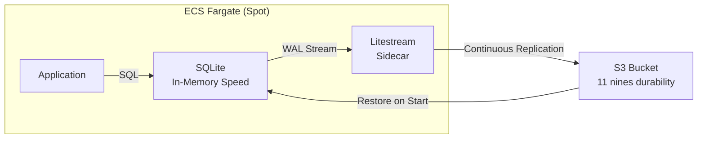
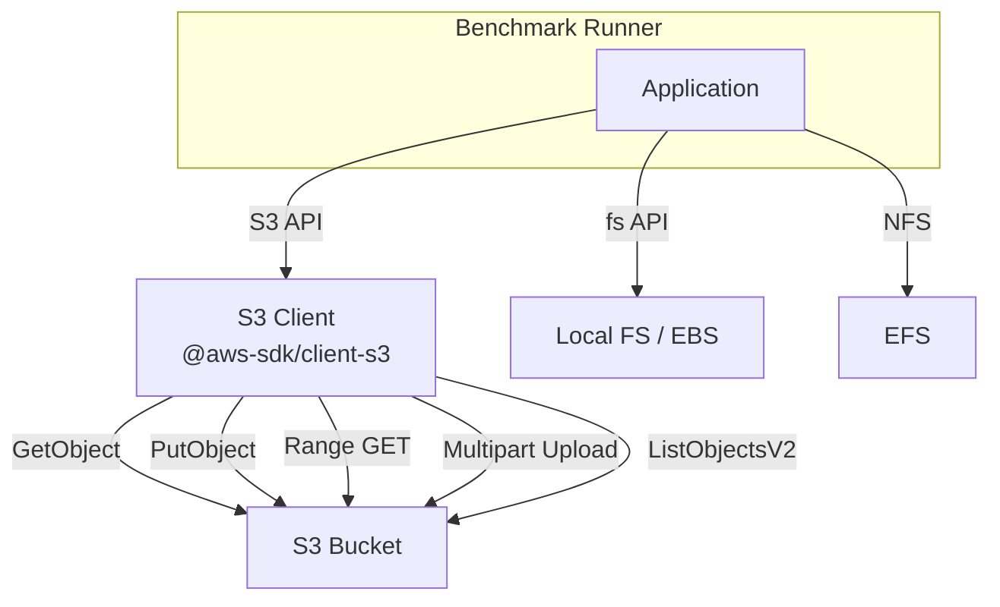
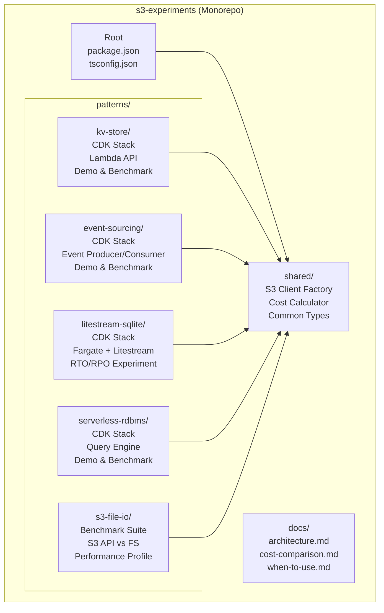
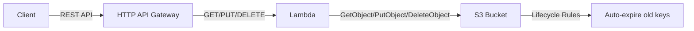
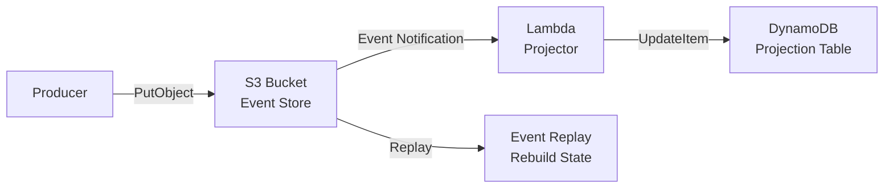
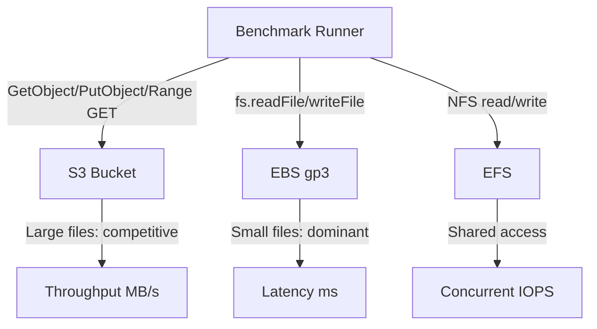
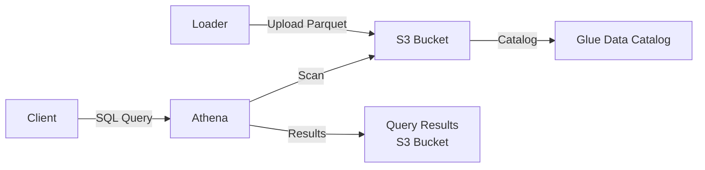

# PRD: S3 Deep Dive — Beyond Object Storage

**Document Version:** 1.0
**Date:** 2026-03-15
**Author:** roboco-io
**Status:** Approved (Consensus: Planner → Architect → Critic)

---

## 1. Executive Summary

S3 Deep Dive는 Amazon S3를 단순한 오브젝트 스토리지가 아닌 **확장된 서비스 플랫폼**으로 재해석하는 오픈소스 프로젝트입니다. Key-Value Store, Event Store, Litestream 기반 내구성 RDBMS, Serverless RDBMS, File I/O 대체 등 **5가지** 핵심 패턴을 TypeScript + AWS CDK v2로 구현하고, 전용 AWS 서비스(DynamoDB, Kinesis, RDS, Aurora, EBS/EFS)와의 비용/성능 벤치마크를 제공합니다.

**핵심 메시지:** "S3가 모든 것을 대체한다"가 아니라, "S3만으로도 충분한 경우가 있고, 그때의 이점은 압도적이다."

---

## 2. Problem Statement

### 현재 상태 (As-Is)
- 개발자들은 새로운 기능이 필요할 때마다 전용 AWS 서비스를 추가합니다
- KV Store가 필요하면 DynamoDB, 캐시가 필요하면 ElastiCache, DB가 필요하면 RDS
- 각 서비스마다 프로비저닝, 모니터링, 보안 설정, 비용 관리가 별도로 필요합니다
- 소규모/중규모 워크로드에서는 이러한 전용 서비스의 최소 비용이 부담이 됩니다

### 목표 상태 (To-Be)
- 개발자가 **S3 하나로 다양한 용도를 커버할 수 있는 선택지**를 갖습니다
- 각 패턴의 장단점을 정직하게 이해하고, 상황에 맞는 결정을 내릴 수 있습니다
- PoC 코드를 바로 배포하여 직접 검증할 수 있습니다

### Pain Points
| Pain Point | Impact | S3 패턴이 해결하는 방법 |
|------------|--------|----------------------|
| 서비스 난립으로 인한 운영 복잡성 | 높음 | S3 + Lambda만으로 구현 가능 |
| 프로비저닝된 용량의 낭비 (과금) | 높음 | 사용한 만큼만 비용 발생 |
| 신규 서비스 학습 곡선 | 중간 | S3 API는 대부분의 개발자가 이미 알고 있음 |
| 인프라 관리 부담 | 중간 | 서버리스, 제로 관리 |

---

## 3. Value Proposition

### 핵심 가치

```
┌─────────────────────────────────────────────────────────────┐
│                    S3 Deep Dive 가치 구조                     │
├──────────────┬──────────────┬──────────────┬────────────────┤
│  비용 효율성   │ 서버리스 단순성 │  무한 확장성   │   11 nines     │
│              │              │              │    내구성       │
│ GB당 $0.023  │ 관리할 서버 0  │ 자동 스케일링  │ 99.999999999%  │
│ 요청당 과금   │ IAM만으로 보안 │ 프리픽스 분산  │ 데이터 손실 0   │
└──────────────┴──────────────┴──────────────┴────────────────┘
```

### 경쟁 우위
- **기존 S3 가이드와의 차별점:** 대부분의 가이드는 정적 호스팅, 데이터 레이크 등 이미 잘 알려진 패턴에 집중. S3 Deep Dive는 Litestream+SQLite 내구성 조합, S3 기반 이벤트 소싱 등 **탐험되지 않은 영역**에 집중
- **벤치마크 기반:** 주장이 아닌 데이터로 증명. 실측/추정 방법론을 투명하게 공개
- **바로 배포 가능:** `cdk deploy` 한 번으로 동작하는 PoC — 읽기만 하는 가이드가 아님

---

## 4. Target Audience

### Primary: 클라우드 네이티브 개발자
- AWS를 일상적으로 사용하는 백엔드/풀스택 개발자
- 비용 최적화에 관심이 있는 스타트업/소규모 팀
- "이미 S3를 쓰고 있는데, 더 활용할 수 없을까?" 라는 질문을 가진 개발자

### Secondary: DevOps / 클라우드 아키텍트
- 인프라 단순화를 추구하는 운영 엔지니어
- 서비스 선택 시 비용/복잡도 트레이드오프를 고려하는 아키텍트

### Tertiary: 기술 커뮤니티
- AWS 블로그/유튜브/밋업에서 S3 관련 콘텐츠를 소비하는 커뮤니티 멤버
- 오픈소스 프로젝트에 기여하는 개발자

---

## 5. Scope

### In Scope (구현 대상)

#### 패턴 1: S3 Serverless Key-Value Store
| 항목 | 상세 |
|------|------|
| **대체 대상** | DynamoDB On-Demand |
| **핵심 메커니즘** | S3 객체 키 = Key, 객체 바디 = Value |
| **구현 범위** | CRUD API (Lambda + API Gateway), TypeScript 클라이언트, TTL (Lifecycle Rules) |
| **벤치마크** | 지연시간 (p50/p95/p99), 처리량 (ops/sec), 비용/1M 연산 |
| **S3가 이기는 경우** | 저빈도 접근, 대용량 값, 비용 민감 워크로드 |
| **DynamoDB가 이기는 경우** | 일관된 밀리초 지연, 트랜잭션, 조건부 쓰기 |

**핵심 연구 질문:** 읽기가 많지 않은 워크로드에서, **수십만 개의 키**를 가진 KV Store로서 S3가 빠른 성능을 유지하면서 비용 효율적으로 작동할 수 있는가?

**실험 설계:**
- 10K / 100K / 500K 키로 스케일업 테스트
- 읽기 빈도별 시나리오: 분당 1회, 10회, 100회, 1000회
- S3 프리픽스 분산 전략에 따른 성능 변화 측정
- DynamoDB On-Demand와의 **종합 비용 비교** (저장 비용 + 요청 비용 + 데이터 전송)
- **결론 도출:** "키 N개 이하, 읽기 빈도 M회/분 이하에서 S3 KV Store가 DynamoDB 대비 X% 비용 절감, 지연시간 Y ms 이내"와 같은 구체적 가이드라인 제시

#### 패턴 2: S3 as Event Store
| 항목 | 상세 |
|------|------|
| **대체 대상** | Kinesis Data Streams / SQS |
| **핵심 메커니즘** | S3 Event Notifications → Lambda → DynamoDB (projection) |
| **구현 범위** | 이벤트 프로듀서, 컨슈머 (Lambda projector), 이벤트 리플레이 |
| **아키텍처 노트** | S3는 이벤트 전송/저장소 역할. 프로젝션은 DynamoDB 사용 (저지연 포인트 리드 필요) |
| **벤치마크** | 이벤트 쓰기 지연, 프로젝션 딜레이, 비용/1M 이벤트 |
| **S3가 이기는 경우** | 내구성 중심 이벤트 로그, 리플레이 가능한 아카이브, 비용 |
| **Kinesis가 이기는 경우** | 실시간 스트리밍, 순서 보장, 샤드 기반 병렬 처리 |

#### 패턴 3: Litestream + SQLite + Fargate — 인메모리 속도 + S3 내구성
| 항목 | 상세 |
|------|------|
| **대체 대상** | RDS (소규모), Aurora Serverless (비중요 시스템) |
| **핵심 메커니즘** | ECS Fargate에서 SQLite 실행 + [Litestream](https://github.com/benbjohnson/litestream)으로 WAL을 S3에 실시간 스트리밍 |
| **구현 범위** | Fargate 태스크 (SQLite + Litestream sidecar), CDK 스택, 장애 복구 데모, Spot 인스턴스 실험 |
| **벤치마크** | RTO (Recovery Time Objective), RPO (Recovery Point Objective), 쿼리 지연시간, 월 비용 vs RDS |
| **이 패턴이 이기는 경우** | 비중요 사내 시스템, 일정 다운타임 허용, 극한 비용 절감, 읽기 중심 워크로드 |
| **RDS가 이기는 경우** | 무중단 요구, 멀티 AZ HA, 동시 쓰기 부하, 대규모 트래픽 |

**핵심 연구 질문:** 인메모리 DB의 속도와 S3의 내구성을 결합하면, 데이터 유실 없이 **극저가 RDBMS**로 사용할 수 있는가? 특히 **Fargate Spot** 사용 시 RTO/RPO는 실용적 수준인가?

**실험 설계:**

1. **기본 아키텍처 검증**
   - Fargate 태스크: SQLite DB + Litestream sidecar (S3로 WAL 스트리밍)
   - 정상 운영 중 쿼리 성능 측정 (SQLite 인메모리 속도 확인)
   - Litestream 복제 지연 측정 (WAL → S3 전파 시간)

2. **Fargate On-Demand 장애 복구 테스트**
   - 태스크 강제 종료 → 새 태스크 시작 → S3에서 복원 → 서비스 재개
   - **RTO 측정:** 태스크 종료 ~ 쿼리 가능 상태까지 소요 시간
   - **RPO 측정:** 마지막 S3 복제 시점과 장애 시점 사이 데이터 유실량

3. **Fargate Spot 실험 (핵심)**
   - Spot 인터럽트 시나리오 시뮬레이션
   - Spot 인터럽트 시그널(SIGTERM) → Litestream graceful shutdown → S3 최종 스냅샷
   - Spot 강제 회수(2분 경고) 시 RPO 측정
   - Spot 가격 대비 On-Demand 비용 절감률 산출

4. **비용 비교 시나리오**
   ```
   시나리오: 비중요 사내 시스템 (직원 100명, 읽기 90% / 쓰기 10%)

   RDS db.t4g.micro:     ~$12.41/월 + 스토리지
   Fargate On-Demand:    ~$X/월 (0.25 vCPU, 0.5GB)
   Fargate Spot:         ~$Y/월 (최대 70% 할인)
   S3 스토리지:          ~$0.023/GB (WAL + 스냅샷)
   ```

5. **적합성 판단 프레임워크**
   - "다운타임 N분 허용 + 데이터 유실 M초 허용 → Litestream 패턴 적합"
   - "무중단 필수 OR 동시 쓰기 10+ TPS → RDS/Aurora 사용"

**아키텍처:**


#### 패턴 4: S3 + Athena Serverless RDBMS
| 항목 | 상세 |
|------|------|
| **대체 대상** | RDS / Aurora Serverless v2 |
| **핵심 메커니즘** | Parquet 파일 + Glue Catalog + Athena SQL 쿼리 |
| **구현 범위** | 데이터 로더 (CSV→Parquet), 쿼리 엔진 래퍼, SQL 데모 (JOIN, 집계) |
| **벤치마크** | 쿼리 지연 (복잡도별), 스캔 비용, 비용/1K 쿼리 |
| **S3+Athena가 이기는 경우** | 분석/보고 쿼리, 비정기 접근, 대규모 데이터셋 |
| **Aurora가 이기는 경우** | OLTP, 고빈도 쓰기, 트랜잭션, 밀리초 쿼리 |

**핵심 연구 질문:** 수 초의 응답 속도를 요구사항이 허용한다면, S3 + Athena를 **관리가 필요 없는 값싼 RDBMS**처럼 사용할 수 있는가?

**실험 설계:**
- **응답 시간 프로파일링:** 쿼리 복잡도별 (단순 SELECT, WHERE 필터, JOIN, GROUP BY + HAVING, 서브쿼리) 응답 시간 분포
- **데이터 규모별 성능:** 1MB / 100MB / 1GB / 10GB Parquet 데이터에 대한 쿼리 지연 변화
- **Parquet 최적화 효과:** 파티셔닝, 컬럼 프루닝, 압축 포맷(Snappy vs ZSTD)에 따른 스캔 비용/속도 차이
- **비용 시나리오 비교:**
  ```
  시나리오: 사내 대시보드 (하루 100개 쿼리, 10GB 데이터)

  Aurora Serverless v2:  ~$X/월 (최소 0.5 ACU 유지)
  S3 + Athena:           ~$Y/월 (스캔 $5/TB + S3 저장 $0.023/GB)
  ```
- **결론 도출:** "응답 시간 N초 이내 허용, 쿼리 빈도 M회/일 이하, 데이터 크기 L GB 이하에서 Athena가 Aurora 대비 X% 비용 절감" 가이드라인 제시
- **실용적 사용 사례:** 사내 보고서, 로그 분석, ad-hoc 데이터 조회, 배치 처리 결과 확인

#### 패턴 5: S3 as File I/O — 파일시스템 대체 가능성
| 항목 | 상세 |
|------|------|
| **대체 대상** | 로컬 파일시스템 (EBS/EFS/FSx) |
| **핵심 메커니즘** | S3 API (GetObject/PutObject/HeadObject)를 직접 사용한 파일 읽기/쓰기 — 마운트가 아닌 API 기반 접근 |
| **구현 범위** | 파일 CRUD 래퍼, 스트리밍 읽기/쓰기, 멀티파트 업로드, Range GET (부분 읽기), 디렉토리 에뮬레이션 |
| **벤치마크** | 읽기/쓰기 지연시간, 처리량 (MB/s), IOPS, 파일 크기별 성능 프로파일 |
| **S3가 이기는 경우** | 대용량 파일 저장, 비용, 내구성, 동시 접근 (서버 간 공유), 무제한 스토리지 |
| **로컬 FS가 이기는 경우** | 저지연 랜덤 I/O, POSIX 호환 필요, 소규모 파일 빈번한 접근, seek/append 패턴 |

**핵심 연구 질문:** S3 API로 직접 파일 읽기/쓰기를 수행할 때, 로컬 파일시스템(EBS gp3) 및 네트워크 파일시스템(EFS) 대비 **어느 수준의 성능**을 기대할 수 있는가? 특히 파일 크기와 접근 패턴에 따라 성능 격차가 어떻게 변하는가?

**실험 설계:**

1. **파일 크기별 읽기/쓰기 성능**
   - 파일 크기: 1KB, 10KB, 100KB, 1MB, 10MB, 100MB, 1GB
   - 각 크기별 S3 GetObject/PutObject vs 로컬 fs.readFile/fs.writeFile 지연시간
   - **가설:** 소규모 파일(<100KB)에서는 S3가 크게 불리, 대규모 파일(>10MB)에서는 격차 축소

2. **순차 vs 랜덤 접근 패턴**
   - 순차 읽기: S3 GetObject (전체 파일) vs fs.createReadStream
   - 부분 읽기: S3 Range GET (특정 바이트 범위) vs fs.read with offset
   - 다중 파일 순차 접근: S3 ListObjects + GetObject vs fs.readdir + fs.readFile
   - **핵심 측정:** S3 Range GET이 "파일 내 seek" 대안으로 실용적인지

3. **동시 접근 성능**
   - 단일 파일에 대한 동시 읽기 (1/10/100 concurrent readers)
   - S3는 본질적으로 동시 읽기에 강함 (서버 간 공유 가능) vs EBS는 단일 인스턴스 제한
   - EFS와의 비교: 동시 접근 시 EFS throttling vs S3 프리픽스 분산

4. **스트리밍 I/O**
   - 대용량 파일 스트리밍 읽기: S3 GetObject stream vs fs.createReadStream
   - 멀티파트 업로드: S3 multipart upload vs fs.write (대용량 쓰기 처리량)
   - **측정:** 처리량 (MB/s) 및 첫 바이트 수신 시간 (TTFB)

5. **비용 비교 시나리오**
   ```
   시나리오: 애플리케이션 데이터 저장소 (100GB, 하루 1000회 읽기/100회 쓰기)

   EBS gp3 (100GB):     ~$8/월 + IOPS/처리량 비용
   EFS (100GB):          ~$30/월 (Standard) / ~$1.6/월 (IA)
   S3 (100GB):           ~$2.30/월 + 요청 비용 (~$0.55)
   ```

6. **디렉토리 에뮬레이션 성능**
   - S3 프리픽스 기반 "디렉토리 구조" 탐색 성능
   - ListObjectsV2 + CommonPrefixes vs fs.readdir 재귀
   - 깊은 디렉토리 구조 (5+ 레벨)에서의 탐색 속도

**아키텍처:**


**적합성 판단 프레임워크:**
- "파일 크기 > N MB, 동시 접근 M+ 클라이언트, 비용 민감 → S3 API 직접 사용 적합"
- "저지연 랜덤 I/O, POSIX 필수, 소규모 파일 빈번 접근 → 로컬 FS/EBS 사용"
- "서버 간 파일 공유 필요, 비용 > 성능 → S3 vs EFS 비교 판단"

### Out of Scope (비대상)
- 프로덕션 레벨 프레임워크/라이브러리 개발
- 모든 가능한 S3 활용 패턴 망라 (5개 선별 집중)
- 다른 클라우드 제공자 (GCP, Azure) 지원
- "S3가 전용 서비스를 완전히 대체한다"는 주장
- 멀티 리전 / 재해복구 시나리오
- 프로덕션 배포 가이드

---

## 6. Technical Architecture

### 전체 구조



### 패턴별 아키텍처

#### Key-Value Store


#### S3 as Event Store


#### Litestream + SQLite + Fargate


#### S3 as File I/O


#### Serverless RDBMS


### 기술 스택
| 계층 | 기술 | 버전 |
|------|------|------|
| 런타임 | Node.js | 20+ |
| 언어 | TypeScript | 5+ |
| IaC | AWS CDK | v2 |
| AWS SDK | @aws-sdk/* | v3 |
| 테스트 | Vitest | latest |
| 패키지 관리 | npm workspaces | - |

---

## 7. Acceptance Criteria

### 전체 프로젝트
- [ ] 5개 핵심 S3 확장 패턴이 구현됨
- [ ] 각 패턴이 `cdk deploy`로 독립 배포 가능
- [ ] 각 패턴이 `cdk destroy`로 완전 정리 가능
- [ ] 각 패턴마다 동작하는 데모 코드 포함
- [ ] 각 패턴마다 전용 서비스 대비 벤치마크 데이터 포함
- [ ] 각 패턴마다 독립적인 README (아키텍처 다이어그램, 사용법, 트레이드오프)
- [ ] 프로젝트 루트에 전체 개요 README 포함
- [ ] TypeScript + CDK v2 기반
- [ ] 영어 문서
- [ ] GitHub 오픈소스 공개 가능 상태
- [ ] IAM 최소 권한 원칙 적용

### 패턴별

#### KV Store
- [ ] CRUD 연산 동작 (JSON + 바이너리 값)
- [ ] Lambda IAM이 특정 버킷 ARN으로 스코핑
- [ ] DynamoDB 실측 벤치마크 포함
- [ ] 10K / 100K / 500K 키 스케일 테스트 결과 포함
- [ ] 읽기 빈도별 성능/비용 교차점 가이드라인 제시

#### S3 as Event Store
- [ ] 이벤트 쓰기 → Lambda 트리거 → 프로젝션 업데이트 파이프라인 동작
- [ ] 이벤트 리플레이 기능 시연
- [ ] DynamoDB 프로젝션 사용 이유가 README에 명시적으로 설명됨

#### Litestream + SQLite + Fargate
- [ ] Fargate 태스크에서 SQLite + Litestream 정상 동작
- [ ] S3로 WAL 실시간 스트리밍 확인
- [ ] Fargate On-Demand 장애 복구 테스트: RTO / RPO 측정
- [ ] **Fargate Spot 인터럽트 테스트: RTO / RPO 측정**
- [ ] Spot 인터럽트 시 SIGTERM → graceful shutdown → S3 최종 스냅샷 검증
- [ ] 비용 비교: Fargate Spot + S3 vs RDS db.t4g.micro
- [ ] 적합성 판단 프레임워크 (다운타임/데이터 유실 허용 범위별 가이드)

#### Serverless RDBMS
- [ ] SQL 쿼리 실행 성공 (SELECT, JOIN, GROUP BY)
- [ ] 샘플 데이터셋 포함
- [ ] 쿼리 복잡도별 응답 시간 프로파일 (단순 SELECT ~ 서브쿼리)
- [ ] 데이터 규모별 (1MB ~ 10GB) 성능 변화 데이터
- [ ] Aurora Serverless v2 대비 비용 절감 시나리오 제시

#### S3 as File I/O
- [ ] 파일 크기별 (1KB ~ 1GB) S3 API vs 로컬 FS 읽기/쓰기 벤치마크
- [ ] 순차 접근 vs Range GET (부분 읽기) 성능 비교
- [ ] 동시 접근 테스트 (1/10/100 concurrent readers)
- [ ] 스트리밍 I/O 처리량 (MB/s) 및 TTFB 측정
- [ ] EBS gp3, EFS와의 3자 비용 비교 시나리오
- [ ] 파일 크기/접근 패턴별 적합성 가이드라인 제시
- [ ] 디렉토리 에뮬레이션 (ListObjectsV2 + CommonPrefixes) 탐색 성능

---

## 8. Benchmark Strategy

### 방법론
| 항목 | 기준 |
|------|------|
| 반복 횟수 | 최소 100회/메트릭, 첫 10회 워밍업 제외 |
| Lambda 지연 | Cold start와 Warm invocation 분리 보고 |
| 비교 방식 | DynamoDB: 실측 (CDK 스택으로 배포). RDS: 실측 (Litestream 패턴 비교용 db.t4g.micro). Aurora/Kinesis: 공식 가격표 기반 추정 (명시적 공개) |
| 통계 | 지연: p50/p95/p99. 처리량: mean ± stddev |
| 리전 | us-east-1 고정 |
| 비용 산정 | 벤치마크 날짜 기준 AWS 공식 가격. 요청/저장/전송 비용 포함 |

### 비교 매트릭스

| 패턴 | S3 패턴 예상 강점 | 전용 서비스 예상 강점 |
|------|-----------------|-------------------|
| KV Store | 비용 (저빈도, 수십만 키), 값 크기 무제한 | 지연시간, 트랜잭션, 조건부 쓰기 |
| Event Store | 비용, 내구성, 무제한 보존, 리플레이 | 실시간성, 순서 보장, 스트림 처리 |
| Litestream+SQLite | 극저가, 인메모리 속도, S3 내구성 결합, Spot 할인 | 무중단 HA, 동시 쓰기 부하, 멀티 AZ |
| Serverless RDBMS | 비용 (비정기 쿼리), 스토리지/컴퓨팅 분리, 제로 관리 | OLTP, 쓰기 성능, 밀리초 쿼리 |
| S3 File I/O | 비용, 내구성, 동시 접근, 무제한 용량, 대용량 파일 | 저지연 랜덤 I/O, POSIX 호환, 소규모 파일 빈번 접근 |

---

## 9. Implementation Phases

### Phase 1: Monorepo Scaffolding
- 프로젝트 초기 구조 생성 (npm workspaces, TypeScript, CDK)
- 공유 유틸리티 (shared/) 구현
- Vitest 설정
- **산출물:** `npm install && npx tsc --build && npm test` 성공

### Phase 2: Pattern Implementation
- 4개 패턴의 CDK 스택 + 데모 코드 구현
- 각 패턴 독립 배포/정리 검증
- IAM 최소 권한 적용
- **산출물:** 4개 동작하는 패턴

### Phase 3: Benchmarks
- 패턴별 벤치마크 스크립트 작성
- KV Store용 DynamoDB 비교 스택 구현
- 벤치마크 실행 및 결과 수집
- **산출물:** 비교 데이터 (JSON + Markdown)

### Phase 4: Documentation
- 패턴별 README (Mermaid 아키텍처, 사용법, 트레이드오프)
- 프로젝트 전체 문서 (architecture.md, cost-comparison.md, when-to-use.md)
- CONTRIBUTING.md
- **산출물:** 커뮤니티 공유 가능한 문서

### Phase 5: Open-Source Polish
- CI/CD 설정 (GitHub Actions)
- 보안 점검 (시크릿, 계정 ID 제거)
- 라이선스 (MIT)
- **산출물:** 공개 가능한 리포지토리

---

## 10. Risks & Mitigations

| Risk | Probability | Impact | Mitigation |
|------|------------|--------|------------|
| Fargate Spot 인터럽트 시 데이터 유실 | 중간 | 높음 | Litestream의 continuous replication으로 RPO 최소화. SIGTERM 핸들러에서 graceful shutdown + 최종 스냅샷. Spot 인터럽트 2분 경고 활용 |
| Litestream S3 복원 시간이 길어질 수 있음 | 중간 | 중간 | DB 크기 제한 가이드라인 제시 (e.g., <1GB). 스냅샷 주기 최적화. 복원 시간 벤치마크로 RTO 투명하게 공개 |
| Athena 쿼리 비용 (개발/벤치마크) | 중간 | 낮음 | 소규모 데이터셋 (<1GB), 쿼리 결과 TTL 설정, Parquet 파티셔닝으로 스캔 최소화 |
| 벤치마크 결과 변동 (리전/시간대) | 중간 | 중간 | 테스트 조건 문서화. 다중 반복. us-east-1 고정 |
| "S3로 왜?" 라는 커뮤니티 회의론 | 중간 | 높음 | 정직한 트레이드오프. "When NOT to use" 섹션 강조. 구체적 비용 절감 수치 제시 |
| S3 KV Store 수십만 키 스케일 시 성능 저하 | 낮음 | 중간 | 프리픽스 분산 전략 적용. ListObjectsV2 대신 직접 키 접근. 스케일별 벤치마크로 한계점 투명하게 공개 |
| SQLite 동시 쓰기 제한 (WAL 모드에서도 단일 writer) | 중간 | 중간 | 적합 사용 사례를 읽기 중심 워크로드로 명확히 한정. 동시 쓰기 부하 벤치마크 포함 |

---

## 11. Success Metrics

### 기술적 완성도 (내부 지표)
- [ ] 5개 패턴 모두 독립 배포 + 동작 확인
- [ ] 벤치마크 데이터 수집 완료
- [ ] 문서 완성 (영어)
- [ ] 개발자가 클론 → 패턴 선택 → 배포까지 10분 이내

### 커뮤니티 반응 (외부 지표 — 장기)
- GitHub Stars
- 블로그/SNS 공유 횟수
- 이슈/PR을 통한 커뮤니티 피드백
- 프로젝트를 참조하는 외부 아티클

---

## 12. Decision Records

### ADR-001: 패턴 선별 (4개)

**결정:** KV Store, Event Store, Litestream+SQLite+Fargate, Serverless RDBMS 4개 패턴 구현

**동기:**
1. S3의 다양한 활용 차원 커버 (KV 저장, 이벤트 로그, 내구성 백업, 쿼리 엔진)
2. 노벨티 우선 (Litestream+Fargate Spot은 커뮤니티에서 거의 실험되지 않음)
3. 각 패턴이 구체적 연구 질문과 함께 검증 가능
4. 비용 민감 사용 사례에 집중 — 실질적 가치 제공

**대안:**
- Express One Zone Cache 포함 — CDK L2 미지원 리스크, Litestream 패턴이 더 독창적이고 실용적
- 3개 패턴 (Litestream 제외) — "인메모리 속도 + S3 내구성" 조합이라는 가장 강력한 스토리 누락
- 5개 패턴 (+Log Analytics with S3 Select) — S3 Select 지원 축소 추세, RDBMS 패턴과 중복
- Static Hosting 포함 — 기존 가이드 포화, 차별화 제로

**결과:**
- Litestream 패턴은 Fargate/ECS 지식 필요 (S3 외 인프라 복잡도 증가)
- Fargate Spot 인터럽트 테스트는 비결정적 — 재현 가능한 테스트 환경 설계 필요
- Athena 쿼리는 개발 중 비용 발생
- 4개 패턴은 각각 독립적인 "연구 질문"을 가져 프로젝트의 학술적/실용적 깊이 강화

### ADR-002: Event Sourcing 패턴에서 DynamoDB 사용

**결정:** 이벤트 저장소는 S3, 프로젝션(materialized view)은 DynamoDB 사용

**동기:**
- S3는 이벤트 전송/내구 저장소 역할 (Kinesis/SQS 대체)
- 프로젝션은 저지연 포인트 리드 필요 → S3로는 불가능
- 아키텍처적으로 정직한 선택: 이벤트 소싱은 본질적으로 이벤트 스토어와 프로젝션 스토어를 분리

**대안:**
- S3 + JSON 프로젝션 — 비실용적 (매 쿼리마다 전체 파일 읽기)
- S3 Select 프로젝션 — S3 Select 지원 축소 추세, 자체 탈락 근거와 모순

### ADR-003: Express One Zone Cache → Litestream+SQLite+Fargate 교체

**결정:** 패턴 3을 S3 Express One Zone Cache에서 Litestream+SQLite+Fargate로 교체

**동기:**
1. Litestream 패턴은 "인메모리 DB 속도 + S3 내구성"이라는 독창적 조합으로 커뮤니티 임팩트가 훨씬 큼
2. Fargate Spot + S3 조합의 RTO/RPO 실험은 거의 선례가 없는 연구
3. 비중요 사내 시스템에 대한 극저가 RDBMS라는 실용적 사용 사례가 명확
4. Express One Zone은 CDK L2 미지원 리스크가 있고, 단순 캐시 계층보다 DB 내구성 문제가 더 흥미로움

**대안:**
- Express One Zone 유지 — CDK L1 워크어라운드 필요, 캐시는 상대적으로 평범한 주제
- 둘 다 포함 (5개 패턴) — "깊이 > 넓이" 원칙 위반, 품질 분산

**결과:**
- Fargate/ECS 인프라 복잡도 증가 (S3 단독 패턴이 아님)
- 하지만 S3의 "내구성 백엔드" 역할을 가장 극적으로 보여주는 패턴
- Spot 인터럽트의 비결정성으로 인한 테스트 복잡도 — 시뮬레이션 전략 필요

---

## 13. RALPLAN-DR Summary

### Principles
1. **깊이 > 넓이** — 4개 잘 구현된 패턴 > 10개 스텁
2. **정직한 트레이드오프** — "When NOT to use" = "When to use"만큼 중요
3. **독립적 모듈성** — 각 패턴이 독립적으로 존재
4. **커뮤니티 우선 DX** — GitHub에서 찾은 개발자를 위해 최적화

### Decision Drivers
1. 패턴 노벨티와 차별화
2. 벤치마크 가능성 (정량적 비교 데이터)
3. PoC로서의 실현 가능성

### Consensus
- **Planner:** 4개 패턴 선별, 5 Phase 구현 계획 수립
- **Architect:** ITERATE — cdk destroy, Event Store 리프레이밍, 벤치마크 방법론, IAM 스코핑 추가 요청
- **Critic:** ACCEPT-WITH-RESERVATIONS — 테스트 전략, DynamoDB 벤치마크 인프라 추가 요청
- **사용자 피드백:** 패턴별 핵심 연구 질문 추가, Express Cache → Litestream+SQLite+Fargate 교체
- **최종:** 모든 피드백 반영 후 합의 도달 (Rev 3)

---

## 14. Appendix: 패턴별 핵심 연구 질문 요약

| 패턴 | 핵심 질문 | 검증 방법 |
|------|----------|----------|
| **KV Store** | 수십만 키 + 저빈도 읽기에서 S3가 DynamoDB 대비 비용 효율적인가? | 10K/100K/500K 키 스케일 테스트 + 읽기 빈도별 비용 교차점 산출 |
| **Event Store** | S3 Event Notifications가 Kinesis를 대체할 수 있는 이벤트 전송 메커니즘인가? | 이벤트 쓰기→프로젝션 파이프라인 + 리플레이 시연 |
| **Litestream+SQLite** | Fargate Spot + Litestream으로 데이터 유실 없는 극저가 RDBMS가 가능한가? | RTO/RPO 실측 (On-Demand vs Spot), Spot 인터럽트 시 graceful shutdown 검증 |
| **Serverless RDBMS** | 수 초 응답을 허용하면 S3+Athena가 관리 불필요한 RDBMS인가? | 쿼리 복잡도별/데이터 규모별 응답 시간 프로파일 + Aurora 대비 비용 비교 |
| **S3 File I/O** | S3 API로 직접 파일 I/O 시 로컬 FS/EBS/EFS 대비 어느 수준의 성능을 기대할 수 있는가? | 파일 크기별 (1KB~1GB) 읽기/쓰기 벤치마크 + 동시 접근 + 비용 비교 |

---

*This PRD was generated through a 3-stage consensus pipeline: Deep Interview (9 rounds, 16% ambiguity) → Ralplan (Planner → Architect → Critic) → User Feedback → Approved (Rev 3).*
