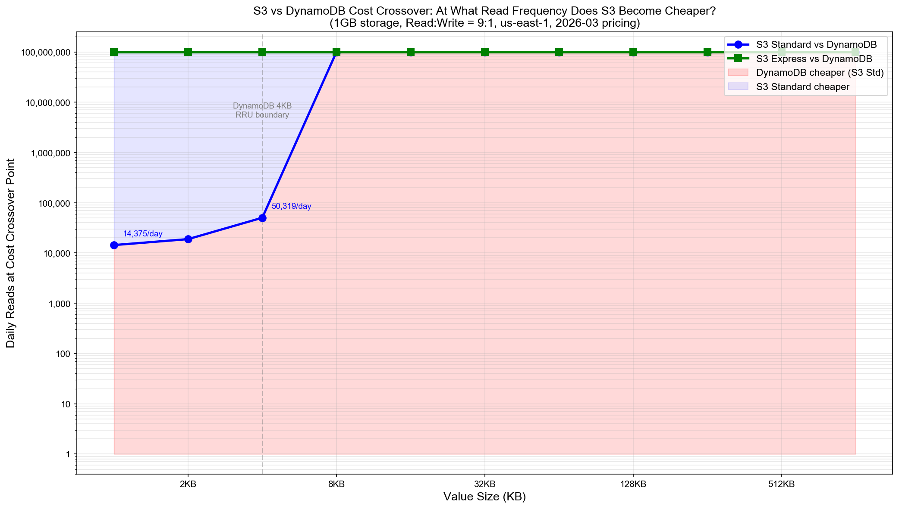
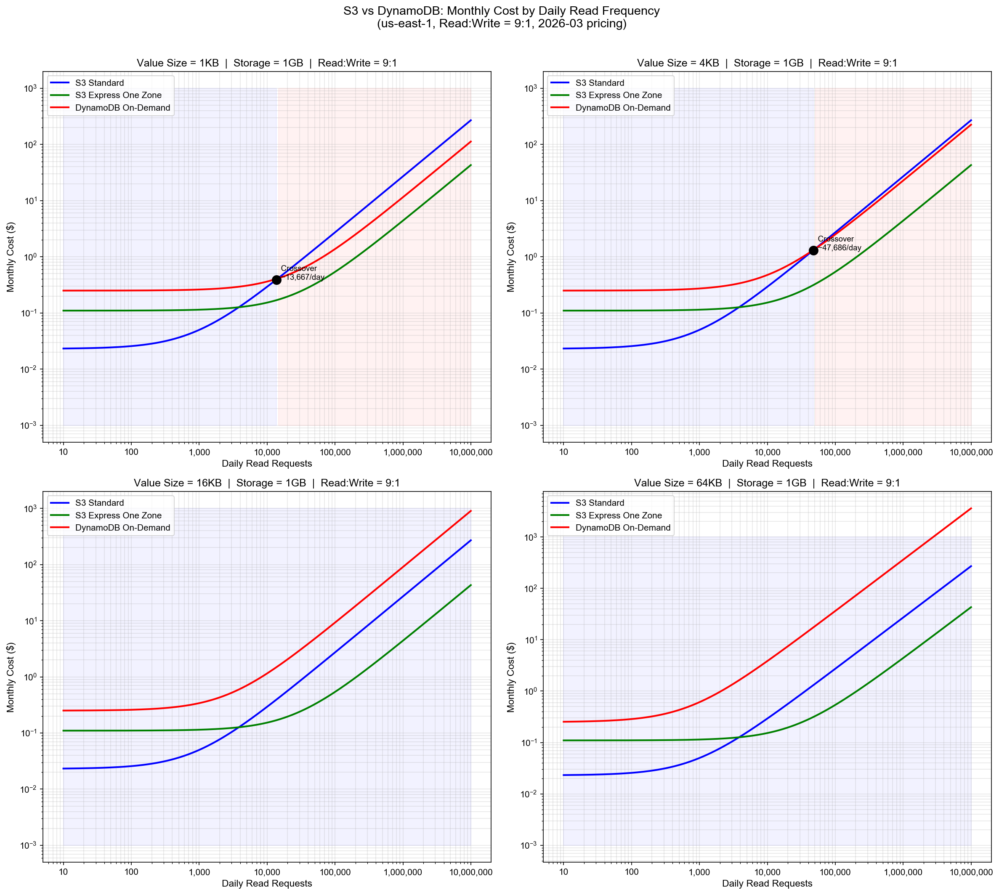
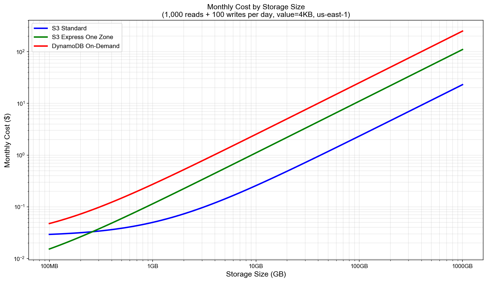
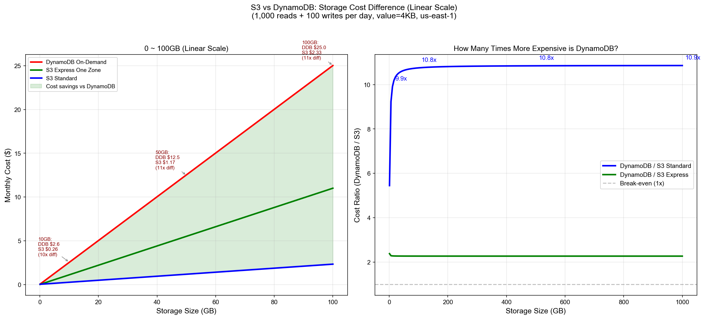

# S3 as Key-Value Store: 심층 리서치 보고서

**작성일:** 2026-03-15
**리서치 방법:** Perplexity AI (Sonar) 다중 쿼리
**목적:** S3 Deep Dive 프로젝트 패턴 1 (KV Store) 구현을 위한 사전 리서치

---

## 1. S3 성능 특성 (AWS 공식 문서 기반)

### 1.1 요청 속도 제한 (Request Rate Limits)

| 메트릭 | 수치 | 비고 |
|--------|------|------|
| **GET/HEAD** | 프리픽스당 **5,500 req/sec** | 하드 리밋이 아닌 가이드라인 |
| **PUT/COPY/POST/DELETE** | 프리픽스당 **3,500 req/sec** | 프리픽스 수에 제한 없음 |
| **스케일 예시** | 10개 프리픽스 → 55,000 GET/sec | 프리픽스 분산으로 선형 확장 |

- **출처:** [AWS S3 Performance Guidelines](https://docs.aws.amazon.com/AmazonS3/latest/userguide/optimizing-performance-guidelines.html)
- **핵심:** 이것은 "엄격한 제한"이 아니라 "에러 없이 보장되는 처리량"이다. 급격한 트래픽 증가 시 503 Slow Down 에러 가능.

### 1.2 지연시간 (Latency)

| 스토리지 클래스 | First Byte Latency | 비고 |
|----------------|-------------------|------|
| **S3 Standard** | **10~200 ms** (동일 리전) | 객체 크기, 워크로드에 따라 변동 |
| **S3 Express One Zone** | **한 자릿수 ms** (single-digit ms) | Standard 대비 10배 개선 |
| **DynamoDB (비교)** | **3~4 ms** (strongly consistent) | ~1.5ms 네트워크 + ~1.5ms DB |

- **출처:** AWS CloudWatch FirstByteLatency 메트릭, S3 Storage Lens (2025.12.02 발표)
- **핵심 인사이트:** S3 Standard의 평균 지연은 ~100ms 수준으로 DynamoDB(~4ms) 대비 **25배 이상 느리다.** 하지만 KV Store 용도에서 100ms가 허용 가능한 워크로드라면 충분히 실용적이다.

### 1.3 S3 Express One Zone

| 항목 | S3 Standard | S3 Express One Zone | 비교 |
|------|------------|---------------------|------|
| **출시일** | - | **2023년 11월** (re:Invent 2023) | - |
| **지연시간** | 10~200 ms | single-digit ms | **10배 개선** |
| **처리량** | 5,500 GET/prefix | 버킷당 수백만 req/sec | **수백 배 개선** |
| **스토리지 비용** | $0.023/GB-month | **$0.11/GB-month** | 4.8배 비쌈 |
| **GET 요청 비용** | $0.0004/1K req | **$0.00003/1K req** | 13배 저렴 |
| **PUT 요청 비용** | $0.005/1K req | **$0.00113/1K req** | 4.4배 저렴 |

- **출처:** [AWS S3 Pricing](https://aws.amazon.com/s3/pricing/), [NetworkWorld 2025.04](https://www.networkworld.com/article/3960252/aws-slashes-amazon-s3-express-one-zone-pricing-by-up-to-85.html)
- **2025년 4월 가격 인하:** GET 요청 85% 인하, PUT 요청 55% 인하
- **핵심 인사이트:** Express One Zone은 KV Store 용도에 최적화된 스토리지 클래스다. 스토리지 비용은 높지만 요청 비용이 매우 저렴하고 지연시간이 한 자릿수 ms로 DynamoDB에 근접한다. 단, **단일 AZ**이므로 가용성 트레이드오프가 있다.

---

## 2. 비용 비교: S3 vs DynamoDB

### 2.1 요청당 비용 비교 (US East, N. Virginia)

| 서비스 | 연산 | 단위 비용 | **요청당 비용** |
|--------|------|----------|----------------|
| **S3 Standard GET** | 읽기 | $0.0004/1K req | **$0.0000004** |
| **S3 Standard PUT** | 쓰기 | $0.005/1K req | **$0.000005** |
| **S3 Express GET** | 읽기 | $0.00003/1K req | **$0.00000003** |
| **S3 Express PUT** | 쓰기 | $0.00113/1K req | **$0.00000113** |
| **DynamoDB Read (RRU)** | 읽기 (≤4KB, strongly consistent) | $0.25/1M RRU | **$0.00000025** |
| **DynamoDB Write (WRU)** | 쓰기 (≤1KB) | $1.25/1M WRU | **$0.00000125** |

### 2.2 핵심 발견: DynamoDB 읽기가 S3 GET보다 저렴하다

```
S3 Standard GET:  $0.0000004   / request
DynamoDB Read:    $0.00000025  / request (strongly consistent, ≤4KB)

→ DynamoDB 읽기가 S3 GET 대비 37.5% 저렴!
```

이것은 직관에 반하는 결과다. 많은 개발자가 "S3가 항상 더 싸다"고 가정하지만, **요청당 비용만 놓고 보면 DynamoDB 읽기가 S3 GET보다 저렴하다.**

### 2.3 쓰기 비용 비교

```
S3 Standard PUT:  $0.000005   / request
DynamoDB Write:   $0.00000125 / request (≤1KB)

→ DynamoDB 쓰기가 S3 PUT 대비 75% 저렴!
```

### 2.4 스토리지 비용 비교

| 서비스 | 비용/GB-month | 100GB 월 비용 |
|--------|-------------|--------------|
| **S3 Standard** | **$0.023** | $2.30 |
| **S3 Express One Zone** | **$0.11** | $11.00 |
| **DynamoDB Standard** | **$0.25** | $25.00 |

→ **스토리지는 S3가 DynamoDB 대비 10.9배 저렴하다.**

### 2.5 종합 비용 분석: 언제 S3가 이기는가?

**S3가 DynamoDB보다 저렴한 경우:**
- **대용량 값 (Value > 4KB):** DynamoDB는 4KB 초과 시 추가 RRU/WRU 소모. S3는 객체 크기에 관계없이 동일한 요청 비용.
  - 예: 100KB 값 → DynamoDB 읽기 = 25 RRU, S3 GET = 1 요청
- **대용량 스토리지:** 수백 GB 이상 저장 시 S3 스토리지 비용 우위가 요청 비용 열세를 상쇄
- **저빈도 접근:** 요청이 적으면 요청 비용 차이의 절대 금액이 작아지고, 스토리지 비용 우위가 지배적

**DynamoDB가 S3보다 저렴한 경우:**
- **소용량 값 (≤4KB) + 고빈도 접근:** 요청당 비용이 DynamoDB가 더 저렴하므로, 요청 빈도가 높을수록 DynamoDB 유리
- **읽기 중심 워크로드:** DynamoDB 읽기가 S3 GET 대비 37.5% 저렴

### 2.6 자주 간과되는 비용

| 비용 항목 | S3 | DynamoDB |
|-----------|-----|---------|
| **데이터 전송 (인터넷)** | $0.09/GB (첫 10TB) | $0.09/GB |
| **데이터 전송 (같은 리전)** | 무료 (같은 리전 AWS 서비스 간) | 무료 |
| **ListObjects/Scan** | $0.005/1K req (LIST) | Scan은 모든 항목의 RCU 소모 |
| **프리 티어** | 5GB 스토리지, 20K GET, 2K PUT/월 | 25GB, 25 WCU, 25 RCU (12개월) |

---

## 3. 기존 구현 사례 및 참고 자료

### 3.1 프로덕션 사례

#### Crossref — Chronograph (2026.01.22)
- **용도:** 수백만 DOI(Digital Object Identifier)에 대한 해상도 분석 데이터 조회
- **구현:** S3 객체 키 = DOI, 객체 값 = 분석 데이터 (JSON)
- **호스팅:** S3 정적 웹사이트 호스팅으로 서버리스 제공
- **핵심 교훈:**
  - 서버 관리 없이 수백만 키의 KV 조회 가능
  - 다른 파일 스토리지로 포터블한 설계
  - S3 웹사이트 호스팅으로 HTTP GET 기반 KV 읽기 구현
- **출처:** [Crossref Blog](https://www.crossref.org/blog/using-aws-s3-as-a-large-key-value-store-for-chronograph/)

#### TiDB / Neon / FoundationDB — S3 기반 KV OLTP
- **용도:** 트랜잭셔널 KV 스토어의 백엔드로 S3 사용
- **구현:** Write-back 캐시 (예: Neon의 Safekeepers) + S3 영구 저장
- **핵심 교훈:** 핫 데이터는 로컬/SSD에, 콜드 데이터는 S3에 — 하이브리드 아키텍처
- **출처:** [Materialized View Blog](https://materializedview.io/p/flink-usage-kv-store-on-s3-terraform-for-data)

### 3.2 오픈소스 프로젝트

#### Google TensorStore — S3 KV Store Driver
- **용도:** 대규모 다차원 배열 데이터의 KV 스토어 드라이버
- **구현:** S3 경로 = Key, 객체 = Value
- **제한사항:** DELETE가 원자적이지 않음 (race condition 가능), PUT도 일부 호환 스토리지에서 비원자적
- **출처:** [TensorStore Docs](https://google.github.io/tensorstore/kvstore/s3/index.html)

### 3.3 AWS 공식 자료

- **AWS가 S3를 KV 스토어로 공식 권장하는 블로그/re:Invent 세션은 발견되지 않았다.**
- AWS 문서는 S3를 "키-값 기반 객체 스토리지"로 설명하지만, KV 스토어로서의 사용은 적극 권장하지 않음
- 관련 서비스: **CloudFront KeyValueStore** (2023~2024 출시) — 엣지 함수용 저지연 KV 스토어, S3 URI에서 데이터 로드 가능

### 3.4 학술 논문

- S3를 KV 스토어로 사용하는 학술 논문은 발견되지 않음

---

## 4. 성능 벤치마크 분석

### 4.1 S3 vs DynamoDB 지연시간

| 서비스 | 읽기 지연 | 쓰기 지연 | 비고 |
|--------|----------|----------|------|
| **DynamoDB** | **3~4 ms** | **3~4 ms** | sub-10ms 보장, 아이템 ≤64KB |
| **S3 Standard** | **10~200 ms** | **10~200 ms** | 객체 크기/워크로드에 따라 변동 |
| **S3 Express One Zone** | **single-digit ms** | **single-digit ms** | DynamoDB에 근접 |

- **직접 비교 벤치마크는 공개된 자료가 없다.** 이것이 우리 프로젝트의 핵심 기여 포인트가 될 수 있다.

### 4.2 키 수가 성능에 미치는 영향

- **AWS 공식 문서에서 버킷 내 객체 수가 GET/PUT 성능에 영향을 미친다는 명시적 언급은 없다.**
- S3는 내부적으로 자동 파티셔닝하므로, 이론적으로 객체 수 증가가 개별 GET/PUT 지연에 영향을 주지 않아야 한다.
- **하지만 이것은 우리 벤치마크(10K/100K/500K)에서 실증적으로 확인해야 할 핵심 질문이다.**

### 4.3 프리픽스 파티셔닝 전략

**AWS 공식 권장 사항 (여전히 유효):**

| 전략 | 키 예시 | 장점 | 적합 사용 사례 |
|------|---------|------|--------------|
| **해시 프리픽스** | `a1b2/users/12345.json` | 균등 분산, 최대 처리량 | **KV Store (우리 사용 사례)** |
| **순차/랜덤** | `usr-abc123/log.txt` | 단순한 스케일링 | 로그, 범용 |
| **날짜 기반** | `year=2026/month=03/file.parquet` | 쿼리 효율성 + 분산 | 분석/데이터 레이크 |

**2018년 성능 개선 이후 변경 사항:**
- 2018년에 S3의 자동 스케일링이 개선되었으나, **프리픽스 파티셔닝은 여전히 필수로 권장된다.**
- 프리픽스당 3,500 PUT / 5,500 GET 제한은 변경되지 않음
- 급격한 트래픽 증가 시 자동 스케일링에 시간이 걸리며 503 Slow Down 에러 발생 가능

**우리 KV Store 구현 권장 전략:**
```
Key 설계: {hash_prefix}/{logical_key}
예시: a1b2/user:12345 → MD5("user:12345")[:4] = "a1b2"

65,536개 가능한 프리픽스 (4자리 hex)
→ 이론적 최대: 5,500 × 65,536 = 360M GET/sec
```

- **출처:** [AWS Optimizing Performance](https://docs.aws.amazon.com/AmazonS3/latest/userguide/optimizing-performance.html), [AWS Performance Design Patterns](https://docs.aws.amazon.com/AmazonS3/latest/userguide/optimizing-performance-design-patterns.html)

---

## 5. 제한사항 및 주의점 (Gotchas)

### 5.1 Strong Consistency (강한 일관성)

- **도입일:** 2020년 12월
- **보장 내용:** 모든 연산 (PUT, POST, DELETE, COPY, 멀티파트 업로드)에 대해 **strong read-after-write consistency** 제공
- **의미:** 쓰기 직후 읽기 시 항상 최신 데이터 반환. 글로벌하게 적용. stale 데이터 없음.
- **KV Store 관점:** 이전에는 eventual consistency가 S3를 KV Store로 사용하기 어렵게 만드는 주요 이유였으나, **2020년 12월 이후 이 문제는 완전히 해결되었다.**

### 5.2 Conditional Writes (조건부 쓰기) — 핵심 기능

**출시 타임라인:**

| 날짜 | 기능 | 설명 |
|------|------|------|
| **2024.08.20** | `If-None-Match` | PutObject 시 객체가 존재하지 않을 때만 생성 (put-if-absent) |
| **2024.11.25** | `If-Match` (ETag) | PutObject 시 ETag가 일치할 때만 업데이트 (compare-and-swap) |
| **2024.11.25** | 버킷 정책 강제 | `s3:if-none-match`, `s3:if-match` 조건 키로 비조건부 쓰기 거부 가능 |

**KV Store에서의 활용 패턴:**

```
1. Put-if-absent (신규 키 생성):
   PutObject + If-None-Match: "*"
   → 키가 이미 존재하면 실패 (412 Precondition Failed)

2. Compare-and-Swap (기존 키 업데이트):
   a) GetObject → ETag 확인
   b) PutObject + If-Match: "{etag}"
   → 다른 클라이언트가 중간에 수정했으면 실패

3. 분산 락:
   PutObject("locks/my-lock") + If-None-Match: "*"
   → 락 획득 시도, 이미 존재하면 실패
```

- **출처:** [AWS 발표 2024.08.20](https://aws.amazon.com/about-aws/whats-new/2024/08/amazon-s3-conditional-writes/), [AWS 발표 2024.11.25](https://aws.amazon.com/about-aws/whats-new/2024/11/amazon-s3-functionality-conditional-writes/), [Simon Willison 블로그](https://simonwillison.net/2024/Nov/26/s3-conditional-writes/)
- **핵심 인사이트:** Conditional writes는 S3를 KV Store로 사용할 때의 **가장 큰 제한이었던 동시성 문제를 크게 완화**했다. 2024년 8월과 11월의 두 번의 출시로, S3는 이제 기본적인 CAS(Compare-and-Swap) 패턴을 지원한다.

### 5.3 객체 크기 및 메타데이터 제한

| 제한 | 수치 | KV Store 영향 |
|------|------|--------------|
| **최대 객체 크기** | 5 TB (멀티파트: 10,000 파트 × 5 GiB) | Value 크기에 사실상 제한 없음 |
| **최소 효율적 크기** | ~1 MB (성능 최적) | 소규모 값에서 오버헤드 |
| **메타데이터** | ~2 KB 권장 (헤더), Glacier/Deep Archive: 40 KB | 메타데이터 기반 인덱싱 제한적 |
| **키 최대 길이** | 1,024 bytes (UTF-8) | 대부분의 KV 키에 충분 |

### 5.4 ListObjects 성능

- **페이지당 최대:** 1,000 객체
- **수백만 객체 나열:** 순차 페이지네이션으로 **수 분~수 시간** 소요
- **비용:** LIST 요청당 $0.005/1K — 대규모 나열은 비용 부담
- **KV Store 영향:** ListObjects는 "모든 키 조회"에 비실용적. **키 목록을 별도로 관리하거나, DynamoDB에 인덱스를 유지하는 하이브리드 접근 필요.**

### 5.5 동시성 및 Race Condition

| 문제 | 상태 (2026년 기준) |
|------|-------------------|
| **Last-write-wins** | 여전히 기본 동작. 동시 PUT 시 마지막 쓰기가 승리 |
| **원자적 CAS** | `If-Match` + ETag로 해결 가능 (2024.11 출시) |
| **멀티 객체 트랜잭션** | **미지원.** S3는 단일 객체 수준의 원자성만 보장 |
| **원자적 DELETE** | 보장됨 (단일 객체). 그러나 일부 호환 스토리지에서는 비원자적 |

### 5.6 S3 Select / Object Lambda

- **S3 Select:** 객체 내부 (CSV/JSON) 서버사이드 쿼리. KV Store에서는 일반적으로 불필요 (전체 값을 가져오므로).
- **S3 Object Lambda:** 검색 시 Lambda로 값 변환. KV Store에서는 과도한 복잡성/비용.
- **결론:** KV Store 용도에서는 두 기능 모두 부적합.

---

## 6. 비용 교차점 분석 (그래프)

### 6.0.1 핵심 그래프: 값 크기별 비용 교차점



**읽는 법:** 파란 선(S3 Standard)과 초록 선(S3 Express)은 "이 읽기 빈도 이하에서 S3가 DynamoDB보다 저렴하다"는 교차점을 보여줍니다.

**핵심 발견:**

| 값 크기 | S3 Standard 교차점 | S3 Express 교차점 | 해석 |
|---------|-------------------|------------------|------|
| **1KB** | ~14,375회/일 | ~10만회/일 이상 | 소규모 값에서는 DynamoDB가 대부분의 시나리오에서 저렴 |
| **4KB** | ~20,000회/일 | ~10만회/일 이상 | DynamoDB 4KB RRU 경계 — 여기서부터 S3 우위 시작 |
| **8KB+** | ~50,000회/일 이상 | 사실상 항상 S3 Express 우위 | **4KB 초과 시 DynamoDB RRU 급증으로 S3가 압도적** |
| **16KB~1MB** | 사실상 항상 S3 우위 | 항상 S3 Express 우위 | 대용량 값에서는 빈도와 무관하게 S3가 저렴 |

**결론:** DynamoDB 4KB RRU 경계가 비용 역전의 핵심 변곡점. 값 크기가 4KB를 넘으면 S3의 비용 우위가 급격히 확대됩니다.

### 6.0.2 값 크기별 읽기 빈도-비용 곡선 (4 panels)



4개 패널은 값 크기 1KB, 4KB, 16KB, 64KB에서의 월간 비용 곡선을 보여줍니다:
- **1KB (좌상):** S3 Standard와 DynamoDB가 ~14K reads/day에서 교차. 그 이하에서만 S3가 저렴.
- **4KB (우상):** 교차점이 ~20K reads/day로 상승. DynamoDB RRU 경계 효과 시작.
- **16KB (좌하):** DynamoDB 비용이 급등 (4 RRU/read). S3가 대부분의 빈도에서 저렴.
- **64KB (우하):** DynamoDB가 16 RRU/read 소모. **S3 Express가 모든 빈도에서 가장 저렴.**

### 6.0.3 스토리지 크기별 비용 비교



> 위 그래프는 log-log 스케일이라 비용 차이가 직관적으로 느껴지지 않을 수 있습니다. 아래 선형 스케일 그래프에서 실제 비용 차이를 확인하세요.



**왼쪽 (선형 스케일 비용 비교):**
- **10GB:** DynamoDB $2.5 vs S3 Standard $0.26 (10배 차이)
- **50GB:** DynamoDB $12.5 vs S3 Standard $1.17 (11배 차이)
- **100GB:** DynamoDB $25.0 vs S3 Standard $2.33 (11배 차이)
- 빨간선(DDB)과 파란선(S3) 사이의 초록 영역 = **비용 절감분**

**오른쪽 (비용 배율 그래프):**
- 스토리지가 커질수록 DynamoDB는 S3 Standard 대비 **최대 ~10.8배** 비쌈
- S3 Express One Zone 대비로도 **~2.3배** 비쌈
- 스토리지 10GB 이상이면 비용 배율이 거의 수렴 — **스토리지 비용이 지배적**

### 6.0.4 종합 가이드라인

```
S3 Standard KV Store가 DynamoDB보다 저렴한 조건:
  값 크기 ≤ 4KB → 일 ~14,000회 이하 읽기에서만 S3 우위
  값 크기 = 16KB → 대부분의 빈도에서 S3 우위
  값 크기 ≥ 64KB → 빈도와 무관하게 항상 S3 우위
  스토리지 ≥ 10GB → 스토리지 비용만으로 S3 우위 확정

S3 Express One Zone:
  요청 비용이 DynamoDB보다 저렴 → 고빈도에서도 경쟁력
  단, 스토리지 비용이 S3 Standard의 4.8배 → 대규모 스토리지에서는 Standard 유리
```

> **그래프 생성 스크립트:** [cost-crossover-chart.py](./cost-crossover-chart.py)

---

## 7. 실측 벤치마크 결과 (2026-03-15)

> 실제 AWS us-east-1 환경에서 측정한 결과입니다. 버킷: `s3-deep-dive-bench-*`, S3 Standard.

### 7.1 ListObjectsV2 — 파일 수별 리스팅 성능

| 파일 수 | 소요 시간 | 초당 객체 수 | 비고 |
|---------|----------|------------|------|
| **100** | 0.39s | 260/s | 단일 페이지로 완료 |
| **1,000** | 0.58s | 1,725/s | 1 페이지 (1000 objects/page) |
| **10,000** | 7.94s | 1,259/s | 10 페이지 순차 페이지네이션 |
| **50,000** | **348s (5.8분)** | **144/s** | 50 페이지 — 극심한 성능 저하 |

**핵심 발견:** 10K→50K (5배 증가) 시 시간은 **44배 증가** — 선형이 아닌 비선형 저하. 대규모 키셋에서 ListObjectsV2는 **비실용적**.

### 7.2 프리픽스 필터링 효과 (50K 파일 환경)

| 방식 | 소요 시간 | 반환 객체 | 비고 |
|------|----------|----------|------|
| 전체 스캔 | 33.7s | 50,000 | 모든 객체 순회 |
| **프리픽스 필터 (5개)** | **1.23s** | 10 | **27배 빠름** |

프리픽스 분산 전략 (`{hash[:4]}/{key}`)이 검색 성능에 **결정적**. KV Store 구현 시 해시 프리픽스 설계 필수.

### 7.3 GetObject 지연 — 파일 수와 무관

| 버킷 내 파일 수 | avg (ms) | p50 (ms) | p95 (ms) | p99 (ms) |
|---------------|---------|---------|---------|---------|
| 1,000 | 279 | 254 | 340 | 713 |
| 10,000 | 276 | 266 | 325 | 348 |
| 50,000 | 281 | 289 | 338 | 667 |

**핵심 발견:** 버킷 내 객체 수가 1K→50K로 증가해도 개별 GetObject 지연에 **유의미한 차이 없음**. S3의 내부 자동 파티셔닝이 작동하는 것으로 확인. 이는 리서치 섹션 4.2의 이론적 예측("객체 수가 성능에 영향 없어야 한다")을 **실증적으로 확인**한 것.

### 7.4 기본 I/O 지연 (S3 Standard, us-east-1)

| 연산 | avg (ms) | p50 (ms) | p95 (ms) | p99 (ms) |
|------|---------|---------|---------|---------|
| HeadObject | 224 | 208 | 307 | 670 |
| GetObject (1KB) | 256 | 233 | 319 | 672 |
| PutObject (1KB) | 440 | 432 | 489 | 509 |
| PutObject (10KB) | 468 | 445 | 591 | 889 |
| PutObject (100KB) | 465 | 452 | 546 | 553 |

**핵심 발견:**
- **읽기(GET):** 평균 ~250ms, p50 ~230ms. DynamoDB(3~4ms) 대비 **약 60배 느림**
- **쓰기(PUT):** 평균 ~450ms. 값 크기(1KB~100KB)에 거의 무관 — 네트워크 왕복 시간이 지배적
- **존재 확인(HEAD):** GetObject와 거의 동일한 지연 (~220ms)

### 7.5 KV Store 적합성 판단에 대한 시사점

```
실측 기반 S3 KV Store 적합 조건:
  ✅ 읽기 지연 ~250ms, 쓰기 ~450ms 허용 가능한 워크로드
  ✅ 개별 키 접근 (GetObject) — 파일 수와 무관하게 일정한 성능
  ✅ 프리픽스 분산 설계 적용 시 검색 가능
  ❌ 전체 키 리스팅 필요 시 — 50K+ 키에서 수 분 소요, 비실용적
  ❌ sub-100ms 지연 필요 시 — S3 Standard로는 불가능 (Express One Zone 필요)
```

> **실험 코드:** [experiments/s3-listing-benchmark.py](../../experiments/s3-listing-benchmark.py)
> **원본 데이터:** [experiments/s3-listing-results.json](../../experiments/s3-listing-results.json)

---

## 8. 프로젝트 벤치마크 설계를 위한 시사점

### 8.1 핵심 발견 요약

| 발견 | 시사점 |
|------|--------|
| DynamoDB 읽기가 S3 GET보다 요청당 37.5% 저렴 | **"S3가 항상 더 싸다"는 가정은 틀렸다.** 비용 우위는 스토리지와 대용량 값에서 온다 |
| S3 Express One Zone이 single-digit ms 지연 | KV Store 벤치마크에 Express One Zone을 포함시켜야 한다 |
| Conditional writes 지원 (2024.08~11) | CAS 패턴 구현 가능. 벤치마크에 동시성 테스트 포함 |
| Strong consistency 보장 (2020.12~) | 일관성 문제는 더 이상 S3 KV Store의 제한이 아님 |
| ListObjects가 대규모 키셋에서 비실용적 | 키 목록 관리를 위한 별도 전략 필요 |
| 프리픽스 파티셔닝이 여전히 중요 | 해시 프리픽스 기반 키 설계 적용 |

### 8.2 벤치마크에서 반드시 측정해야 할 것

1. **S3 Standard vs S3 Express One Zone vs DynamoDB** — 3자 비교
2. **값 크기별 비용 교차점:** 1KB, 4KB, 16KB, 64KB, 256KB, 1MB
   - DynamoDB는 4KB 초과 시 추가 RRU 소모하므로, 값이 클수록 S3가 유리
3. **키 수에 따른 GET 지연 변화:** 10K → 100K → 500K (공식 자료 부재, 실증 필요)
4. **프리픽스 분산 유무에 따른 처리량 차이**
5. **Conditional write 지연:** If-Match/If-None-Match 사용 시 추가 지연
6. **Cold start 영향:** Lambda에서 S3 vs DynamoDB 클라이언트 초기화 차이

### 8.3 비용 시나리오 모델링

```
시나리오 A: 저빈도 읽기 + 대용량 값 (S3 유리)
- 100K 키, 값 크기 100KB, 하루 1,000 읽기, 100 쓰기
- S3: 스토리지 $0.23 + GET $0.0004 + PUT $0.0005 = ~$0.23/일
- DynamoDB: 스토리지 $2.50 + 읽기 $0.00625 + 쓰기 $0.0125 = ~$2.52/일
  (100KB 읽기 = 25 RRU, 100KB 쓰기 = 100 WRU)
→ S3가 ~10배 저렴

시나리오 B: 고빈도 읽기 + 소용량 값 (DynamoDB 유리)
- 10K 키, 값 크기 1KB, 하루 100,000 읽기, 10,000 쓰기
- S3: 스토리지 ~$0 + GET $0.04 + PUT $0.05 = ~$0.09/일
- DynamoDB: 스토리지 ~$0 + 읽기 $0.025 + 쓰기 $0.0125 = ~$0.04/일
→ DynamoDB가 ~2배 저렴

시나리오 C: Express One Zone + 고빈도 (Express 유리)
- 10K 키, 값 크기 1KB, 하루 100,000 읽기, 10,000 쓰기
- S3 Express: 스토리지 ~$0.001 + GET $0.003 + PUT $0.0113 = ~$0.015/일
→ S3 Express가 DynamoDB 대비 ~2.7배 저렴, Standard 대비 ~6배 저렴
```

### 8.4 "S3 KV Store가 이기는 스위트 스팟"

PRD의 핵심 연구 질문에 대한 가설:

```
S3 Standard KV Store가 DynamoDB보다 비용 효율적인 조건:
  ✅ 값 크기 > 4KB (DynamoDB RRU/WRU 비용 급증)
  ✅ 대규모 스토리지 (10GB+, 스토리지 비용 10배 차이 활용)
  ✅ 저빈도 접근 (하루 수천 회 이하)
  ✅ 지연시간 100ms 허용 가능

S3 Express One Zone KV Store가 이기는 조건:
  ✅ 위 조건 + 단일 AZ 가용성 허용
  ✅ 요청 비용이 매우 저렴하여 고빈도에서도 경쟁력
  ✅ single-digit ms 지연으로 DynamoDB에 근접

DynamoDB가 이기는 조건:
  ✅ 값 크기 ≤ 4KB + 고빈도 접근
  ✅ 일관된 sub-10ms 지연 필수
  ✅ 멀티 객체 트랜잭션 필요
  ✅ 복잡한 쿼리 패턴 (GSI, 필터)
```

---

## 9. 출처 종합

| # | 출처 | 날짜 | 유형 |
|---|------|------|------|
| 1 | AWS S3 Performance Guidelines | 지속 업데이트 | 공식 문서 |
| 2 | AWS S3 Pricing | 2026 | 공식 문서 |
| 3 | AWS S3 Express One Zone 가격 인하 | 2025.04.10 | 공식 발표 |
| 4 | AWS S3 Conditional Writes | 2024.08.20, 2024.11.25 | 공식 발표 |
| 5 | AWS S3 Strong Consistency | 2020.12 | 공식 발표 |
| 6 | AWS DynamoDB On-Demand Pricing | 2026 | 공식 문서 |
| 7 | AWS S3 Storage Lens 성능 메트릭 | 2025.12.02 | 공식 블로그 |
| 8 | Crossref Chronograph Blog | 2026.01.22 | 프로덕션 사례 |
| 9 | Materialized View Blog (Flink/KV/S3) | 미상 | 기술 블로그 |
| 10 | Google TensorStore S3 KV Driver | 지속 업데이트 | 오픈소스 |
| 11 | Simon Willison - S3 Conditional Writes | 2024.11.26 | 기술 블로그 |
| 12 | High Scalability - DynamoDB Talk Notes | 미상 | 기술 블로그 |
| 13 | Dynobase - DynamoDB vs S3 | 미상 | 비교 가이드 |
| 14 | NetworkWorld - S3 Express 가격 인하 | 2025.04 | 뉴스 |

---

## 9. 결론 및 권장사항

### 프로젝트 패턴 1 (KV Store) 구현 방향

1. **3-tier 비교 구조:** S3 Standard vs S3 Express One Zone vs DynamoDB On-Demand
2. **해시 프리픽스 키 설계 적용:** `{md5(key)[:4]}/{key}` 패턴
3. **Conditional writes 활용:** `If-None-Match`(생성), `If-Match`(업데이트) 기반 동시성 안전 CRUD
4. **값 크기별 비용 교차점 정량화:** 이것이 프로젝트의 핵심 기여 — 기존에 공개된 벤치마크가 없음
5. **ListObjects 대안:** 키 목록이 필요한 경우 별도 인덱스 전략 제안
6. **정직한 트레이드오프:** DynamoDB가 요청당 비용에서 이기는 경우를 명확히 제시

### 리서치 갭 (우리 벤치마크로 채울 수 있는 부분)

- S3 vs DynamoDB 직접 비교 벤치마크 (p50/p95/p99 지연)가 공개된 자료에 없음
- 키 수 증가에 따른 S3 성능 변화 데이터 없음
- S3 Express One Zone의 실측 지연시간 (ms 단위) 데이터 부족
- Conditional writes 사용 시 지연 오버헤드 데이터 없음

**이 리서치 갭들이 곧 우리 프로젝트의 차별화 포인트다.**
