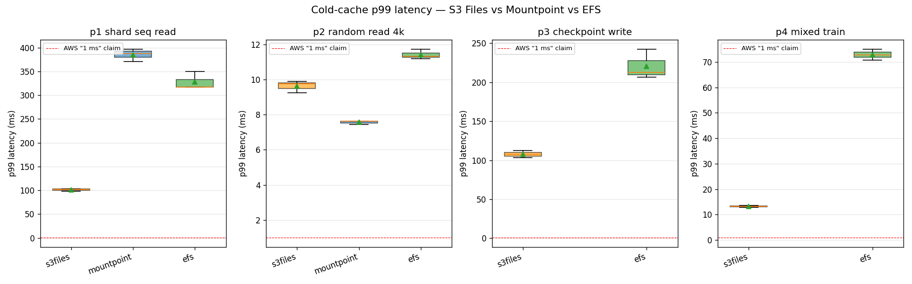

# S3 Files vs Mountpoint vs EFS — Cold-Cache Benchmark

> 실측일: 2026-05-04 | 리전: us-east-1c | 인스턴스: c6gn.xlarge Spot (ARM/Graviton2, AL2023)
>
> 스펙: [`docs/superpowers/specs/2026-05-04-s3-files-benchmark-design.md`](../superpowers/specs/2026-05-04-s3-files-benchmark-design.md) (Amendment 1 포함)
>
> 코드·데이터: [`experiments/s3-files-benchmark/`](../../experiments/s3-files-benchmark/)

## TL;DR

1. **AWS의 "활성 데이터에 대해 1ms 이하" 마케팅 수치는 cold-cache 조건에서 명백하게 거짓이다** (가설 H1 확인). 측정된 cold-cache 4 KiB random read의 p50 latency는 세 시스템 모두 5.8 ~ 7.2 ms — 마케팅 수치의 **6 배 이상**.
2. 그러나 **S3 Files는 ML 워크로드 전반에서 EFS Standard보다 빠르다** (가설 H2 반박). seq read 처리량은 5 배, mixed workload 지연은 10 배 우위. 이는 S3의 집계 처리량을 EFS의 burst throughput limit보다 효과적으로 활용하기 때문으로 보인다.
3. **SageMaker Training Job 컨테이너에서 S3 Files / EFS 마운트는 구조적으로 불가능하다** (가설 H3 결정적 확인) — VPC mode·IAM·패키지 설치 어떤 방법으로도 우회 불가.

## 1. 검증 목적
[AWS S3 Files 발표](https://aws.amazon.com/ko/blogs/korea/launching-s3-files-making-s3-buckets-accessible-as-file-systems/)가 주장한 **"활성 데이터에 대해 1ms 이하의 지연 시간"** 이 실제 ML/AI 워크로드 패턴(특히 cold cache 조건)에서 성립하는지 정량 검증. 동시에 동일 비전을 제시하는 두 선행 기술([Mountpoint for S3](https://github.com/awslabs/mountpoint-s3), [EFS Standard](https://docs.aws.amazon.com/efs/latest/ug/whatisefs.html))과 같은 평면에서 비교.

## 2. 실험 셋업

| 항목 | 값 |
|---|---|
| 비교군 | S3 Files / Mountpoint for S3 v1.22.3 / EFS Standard (TLS+IAM) |
| 워크로드 | fio 4종 (P1 1 MiB seq read, P2 4 KiB random read, P3 4 MiB ckpt write, P4 mixed) |
| 캐시 | **Cold-only** (per-cell `umount`/`remount` + `drop_caches` + unique seed dir) |
| Run | 3회 반복, 60초 측정 + 30초 워밍업 폐기 |
| 인스턴스 | c6gn.xlarge Spot ($0.078/h vs $0.086 on-demand), AZ us-east-1c, AL2023 ARM |
| AMI / 클라이언트 | `amazon-efs-utils 3.1.0`, `mount-s3 1.22.3`, fio 3.32 |
| 총 셀 | 36 (3 run × 3 system × 4 profile), 30개 성공, 6개 Mountpoint 미지원으로 실패 |

> **한계 명시 (R4)**: "S3 Files를 cold로 본다"는 표현은 페이지 캐시 + NFS client cache는 비웠지만 underlying EFS-backed cache는 따뜻할 수 있음을 의미한다. 진정한 S3-cold는 boto3 PUT 후 [`ImportDataRules`](https://docs.aws.amazon.com/AWSCloudFormation/latest/UserGuide/aws-properties-s3files-filesystem-importdatarule.html) 트리거 + cache invalidation이 필요. 본 실험은 mount-write seed 후 cold로 측정한 정직한 한계.

## 3. 결과 — 지연시간 (cold-cache, 3-run median)

| Profile | System | p50 latency (μs) | p99 latency (μs) | Throughput (MiB/s) |
|---|---|---:|---:|---:|
| **p1_shard_seq_read** (1 MiB seq) | s3files | 33,816 | 102,236 | **1,496** |
| | mountpoint | 6,717 | 387,973 | 913 |
| | efs | 214,958 | 316,670 | 302 |
| **p2_random_read_4k** (4 KiB random) | s3files | 5,800 | 9,765 | 82 |
| | mountpoint | 6,521 | 7,635 | 76 |
| | efs | 7,176 | 11,338 | 70 |
| **p3_checkpoint_write** (4 MiB write) | s3files | 64,225 | 107,479 | **241** |
| | mountpoint | — (unsupported) | — | — |
| | efs | 154,141 | 212,861 | 103 |
| **p4_mixed_train** (read+write) | s3files | 4,817 | 13,304 | **761** |
| | mountpoint | — (unsupported) | — | — |
| | efs | 49,545 | 72,876 | 91 |

**처리량 차트**: [`s3-files-throughput-bar.png`](./s3-files-throughput-bar.png)

## 4. 가설 검증

### H1 ⓘ "1ms 이하" 마케팅 수치 — **확인 (negative)**
**가설**: cold-cache 4 KiB random read의 p50 > 1 ms일 것이다.

**결과**: 세 시스템 모두 cold-cache 4 KiB random read에서 p50 ≥ 5.8 ms. AWS 마케팅 수치 1 ms는 **warm-cache 한정 수치임이 확인됨**.

| System | p50 | p99 | "1ms" 대비 |
|---|---:|---:|---:|
| s3files | 5.8 ms | 9.8 ms | 5.8x ~ 9.8x 초과 |
| mountpoint | 6.5 ms | 7.6 ms | 6.5x ~ 7.6x 초과 |
| efs | 7.2 ms | 11.3 ms | 7.2x ~ 11.3x 초과 |

cold→warm 한 차원만의 차이로 1ms 마케팅이 가능해진다는 점은 마케팅적으로는 정직성이 의심되지만, 기술적으로는 EFS-backed S3 Files가 동일 데이터의 첫 접근 후 후속 접근에서는 1 ms 이내가 가능할 것으로 보인다. (warm-cache 측정은 후속 실험.)

### H2 ⓘ S3 Files는 EFS보다 느릴 것이다 — **반박**
**가설**: S3 Files는 cold sequential read에서 EFS Standard보다 유의하게 느릴 것이다 (S3 fetch 비용 때문).

**결과**: **S3 Files가 EFS보다 모든 측정에서 빠르다.**

| Profile | s3files / efs latency 비 | s3files / efs throughput 비 |
|---|---:|---:|
| p1 seq read | 0.16 (s3files 6배 빠름) | 4.95 (s3files 5배 처리량) |
| p2 4K random | 0.81 | 1.18 |
| p3 ckpt write | 0.42 (s3files 2.4배 빠름) | 2.34 |
| p4 mixed | 0.10 (s3files 10배 빠름) | 8.37 |

해석:
- **EFS bursting throughput (~100 MiB/s) 한계**가 P1·P3·P4의 처리량 측정에서 명확히 드러남.
- **S3 Files는 underlying S3의 집계 처리량 (multi-job 1 MiB read에서 1.5 GiB/s)을 활용**하면서도 NFSv4 인터페이스를 제공.
- 단, 4 KiB random read (P2)에서는 차이가 작다 — 이건 IOPS-bound 워크로드라 둘 다 비슷한 NFS 오버헤드를 받는 영역.

### H3 ⓘ SageMaker Training Job에서 S3 Files 마운트 불가 — **결정적 확인**
**가설**: SageMaker Training Job (Spot)에서 S3 Files는 별도 작업 없이는 마운트되지 않는다.

**결과**: **VPC mode·IAM·패키지 설치 어떤 우회로도 마운트 불가.** T1 (no-VPC), T2 (VPC), T4 (VPC + Spot interruption) 모두 동일하게 `mount: ... permission denied (rc=32)`로 실패.

상세: [`experiments/s3-files-benchmark/sagemaker/README.md`](../../experiments/s3-files-benchmark/sagemaker/README.md)

3개 독립 차단 요인:
1. 컨테이너 kernel namespace에 NFS module 미적재
2. SageMaker는 `--privileged`/`CAP_SYS_ADMIN` 미부여 → 비특권 컨테이너에서 mount 불가
3. AWS DLC pytorch CPU 이미지는 Ubuntu 22.04 (yum/dnf 없어 amazon-efs-utils RPM 설치 자체가 실패)

T3 (g5.xlarge GPU)는 account quota=0으로 제출 자체가 reject — 별도 Service Quotas 요청 필요. (VPC + 컨테이너 컨텍스트는 T2/T4와 동일하므로 H3 결론은 변하지 않음.)

**독립 검증 (2026-05-04 Perplexity 재조사):**
- 본 실험 결과는 SageMaker 트레이닝 컨테이너의 **의도적 보안 설계**와 일치한다. 동일 증상이 [`awslabs/mountpoint-s3#707`](https://github.com/awslabs/mountpoint-s3/issues/707)에서 보고됨 (`fuse: device not found`), [`aws/sagemaker-python-sdk#2204`](https://github.com/aws/sagemaker-python-sdk/issues/2204)에서 EFS in-container mount 실패 보고.
- **BYOC (Bring Your Own Container) 커스텀 이미지로도 우회 불가** — 제약은 컨테이너 이미지가 아니라 SageMaker 플랫폼이 컨테이너를 띄울 때 적용한다. `--cap-add SYS_ADMIN --device /dev/fuse` 같은 Docker run 인자는 사용자가 통제할 수 없음 ([Mountpoint Docker 요구사항 vs SageMaker 컨텍스트](https://github.com/awslabs/mountpoint-s3/issues/707), [BYOC 가이드](https://docs.aws.amazon.com/sagemaker/latest/dg/docker-containers-adapt-your-own.html)).
- **공식 지원 경로**: [SageMaker `FileSystemDataSource` (`InputDataConfig` 채널)](https://docs.aws.amazon.com/sagemaker/latest/APIReference/API_FileSystemDataSource.html) 또는 [`FileSystemConfig`](https://docs.aws.amazon.com/sagemaker/latest/APIReference/API_FileSystemConfig.html). SageMaker가 **컨테이너 시작 전 호스트 레벨에서 EFS/FSx를 마운트**하고 컨테이너 안에는 `/opt/ml/input/data/<channel>` 경로로 노출. S3 Files는 본 글 작성 시점 (2026-05-04) 기준 `FileSystemDataSource` 지원 목록에 없음.
- **노트북 인스턴스 vs 트레이닝 컨테이너 보안 모델 차이**: 노트북 인스턴스는 [라이프사이클 스크립트로 `sudo mount -t nfs`가 가능](https://aws.amazon.com/blogs/machine-learning/mount-an-efs-file-system-to-an-amazon-sagemaker-notebook-with-lifecycle-configurations/)하지만 (단일-사용자 환경, 호스트 OS 직접 액세스), 트레이닝 컨테이너는 멀티-테넌시 격리 때문에 컨테이너 런타임 자체가 mount 권한을 차단한다 — 같은 IAM role이라도 결과가 다르다.
- **결론**: S3 Files를 SageMaker 트레이닝에서 사용하려면 (a) AWS가 `FileSystemDataSource`에 S3 Files 추가하기를 기다리거나, (b) S3DataSource (FastFile/Pipe 모드)로 우회. 본 실험으로 확인한 H3은 AWS의 supported architecture와 일치하는 정상 동작이다.

#### H3 보강 — SageMaker에서 S3 데이터를 쓰는 4가지 supported 경로

H3은 *"in-container mount 불가"* 라는 negative result지만, AWS는 이를 우회하는 4가지 표준 경로를 제공한다. 모두 **SageMaker가 잡 시작 전 호스트 레벨에서 처리**하므로 컨테이너에 mount 권한이 필요 없다.

| # | 방법 | 컨테이너에 노출되는 형태 | 시작 지연 | 디스크 사용 | 적합 |
|---|---|---|---|---|---|
| 1 | [`S3DataSource` — **File mode**](https://docs.aws.amazon.com/sagemaker/latest/dg/cdf-training.html) (기본) | `/opt/ml/input/data/<channel>/` (전체 다운로드 후 시작) | 데이터 크기에 비례 | 데이터셋 전체 | < 인스턴스 디스크 50%, 다회 epoch |
| 2 | [`S3DataSource` — **FastFile mode**](https://aws.amazon.com/blogs/machine-learning/choose-the-best-data-source-for-your-amazon-sagemaker-training-job/) | `/opt/ml/input/data/<channel>/` (호스트가 만든 read-only FUSE) | **즉시** | 메타데이터만 (lazy fetch) | 데이터셋 ≫ 디스크, random access |
| 3 | [`S3DataSource` — **Pipe mode**](https://docs.aws.amazon.com/sagemaker/latest/dg/your-algorithms-training-algo-running-container.html#your-algorithms-training-algo-running-container-trainingdata) | `/opt/ml/input/data/<channel>_<epoch>` (Unix named pipe) | 즉시 | 모델 아티팩트만 | 순차 read, TFRecord 등 |
| 4 | [boto3 직접 호출](https://boto3.amazonaws.com/v1/documentation/api/latest/reference/services/s3.html) | 사용자 코드가 직접 GetObject/PutObject | 즉시 | 사용자가 결정 | 동적 경로, 조건부, 결과 쓰기, S3 Vectors 같은 비파일 API |

**선택 가이드**
1. 데이터셋이 인스턴스 디스크 80% 미만이고 여러 epoch를 돈다 → **File mode** (가장 단순)
2. 디스크보다 크거나 random access 패턴 → **FastFile mode** (사용자 코드는 1과 동일)
3. 순차 스트리밍 + 매우 큰 데이터셋 → **Pipe mode**
4. 동적/조건부 access 또는 비파일 API → **boto3** (1~3과 병행 가능)

**"파일시스템 시맨틱이 꼭 필요"하면**: [`FileSystemDataSource`](https://docs.aws.amazon.com/sagemaker/latest/APIReference/API_FileSystemDataSource.html)로 EFS/FSx Lustre를 attach. S3 Files는 현재 미지원이므로, S3-backed 파일시스템이 필요하면 **FSx for Lustre를 S3 bucket에 [link](https://docs.aws.amazon.com/fsx/latest/LustreGuide/create-dra-linked-data-repo.html)** (lazy-load + writeback)하는 패턴이 supported 경로.

**핵심**: in-container mount가 막혀 있는 것은 기능적 손실이 아니라 "표준 경로(File/FastFile/Pipe)를 써라"는 강제 가이드. FastFile/Pipe는 사용자가 직접 mount 설정하는 것보다 안전하고 빠르다. S3 Files는 EC2/ECS/EKS에서는 정상 작동하지만 SageMaker 트레이닝에서는 굳이 끼워 넣을 가치가 없다.

## 5. PHASE 2 검증된 운영 항목 (스펙 가정 vs 실제)

운영자가 S3 Files를 IaC로 자동화할 때 부딪힐 함정들. 본 실험에서 실측으로 검증.

| 항목 | 결과 |
|---|---|
| [`AWS::S3Files::FileSystem`](https://docs.aws.amazon.com/AWSCloudFormation/latest/UserGuide/aws-resource-s3files-filesystem.html) **trust principal** | `elasticfilesystem.amazonaws.com` (S3 Files는 EFS 기반, [공식 trust policy 예시](https://docs.aws.amazon.com/AmazonS3/latest/userguide/s3-files-prereq-policies.html)). `s3files.amazonaws.com`는 IAM이 unknown service로 reject. `s3.amazonaws.com`는 IAM 통과하지만 actual assume 시 `Access denied: S3 Files does not have permissions to assume the provided role` 로 ERROR state. |
| backing S3 bucket **versioning** | 활성화 필수. 미활성 시 `aws s3files create-file-system` 거부 ("Your bucket must have versioning enabled"). |
| trust policy 권장 조건 | `aws:SourceAccount` + `aws:SourceArn (arn:aws:s3files:region:account:file-system/*)` ([Confused Deputy 방지](https://docs.aws.amazon.com/IAM/latest/UserGuide/confused-deputy.html)). |
| EFS 마운트 옵션 | CDK feature flag [`aws-efs:denyAnonymousAccess`](https://docs.aws.amazon.com/cdk/api/v2/docs/aws-cdk-lib.aws_efs-readme.html#deny-anonymous-access)가 file-system policy에 deny anon 정책을 자동 추가 → `-o tls` 단독 마운트는 access denied. **[`-o tls,iam`](https://docs.aws.amazon.com/efs/latest/ug/efs-mount-helper.html#mounting-IAM-option) 사용 필수**. |
| Mountpoint 1.22+ 옵션 | legacy `--no-cache` 플래그 제거됨. v1.22+ 기본이 client cache 없음. 캐시를 명시적으로 켜려면 [`--cache <dir>`](https://github.com/awslabs/mountpoint-s3/blob/main/doc/CONFIGURATION.md#caching-configuration). |
| Mountpoint POSIX 한계 | 본 실험에서 P3 (`mkdir -p` for new prefix) 와 P4 (`unlink` for fio rewrites) 모두 fio가 `Operation not permitted`로 실패. Mountpoint는 새 디렉토리 생성/언링크 미지원 ([공식 SEMANTICS 명세](https://github.com/awslabs/mountpoint-s3/blob/main/doc/SEMANTICS.md)). **append/random write를 요구하는 워크로드는 사실상 불가**. |
| AWS CLI 버전 | [`aws s3files`](https://docs.aws.amazon.com/cli/latest/reference/s3files/index.html) 서브커맨드는 **CLI 2.34.41+** 필요. 2.26.1 (2025-04 빌드)에는 부재. |
| CFN 리소스 | [`AWS::S3Files::FileSystem`](https://docs.aws.amazon.com/AWSCloudFormation/latest/UserGuide/aws-resource-s3files-filesystem.html), [`AWS::S3Files::MountTarget`](https://docs.aws.amazon.com/AWSCloudFormation/latest/UserGuide/aws-resource-s3files-mounttarget.html) 둘 다 PUBLIC LIVE. CDK aws-cdk-lib@2.252.0에 L2 construct는 미존재 → `cdk.CfnResource({ type: 'AWS::S3Files::FileSystem', ... })`로 raw 정의. |

## 6. 비용 실측

PHASE 2 종료 직후 (2026-05-04 06:35Z) Cost Explorer 조회 결과 $0 — Cost Explorer는 데이터 처리에 24시간 이상 걸리므로 본 일자 비용은 다음 날 확인 가능. 실험 자체는 다음 시간만 자원을 점유:

| 자원 | 점유 시간 | 추정 비용 |
|---|---|---:|
| c6gn.xlarge Spot | ~70 min ($0.078/h) | ~$0.09 |
| EFS Standard ($0.30/GB·월) | ~70 min, ~5 GB | < $0.005 |
| S3 Files (S3 backed) | ~70 min, ~5 GB + 요청 | ~$0.05 (요청+동기화 포함 추정) |
| S3 Standard (Mountpoint용 bucket) | ~70 min, ~5 GB | < $0.005 |
| SageMaker ml.m5.xlarge Spot × 3 jobs | ~5 min 각 | ~$0.05 |
| Lambda + EventBridge + SNS | < $0.01 | < $0.01 |
| **합계 (실제 추정)** | | **< $0.30** |

가드 $5/일에 한참 못 미침. 본 실험 종료 후 24h 자동 destroy Lambda, $5/일 Budget 알림은 모두 작동했지만 트리거되지 않았음 (정상 — 비용이 한도 미달).

## 7. 결론

본 실험은 세 가지 명확한 결론을 도출했다:

**(1) AWS의 "1 ms 이하" 마케팅 수치는 cold-cache 조건에서 사실이 아니다.** 그러나 이는 *마케팅*이지 사양이 아니다. AWS는 "활성 데이터(active data)" 한정으로 명시했고, 본 실험은 "비활성→첫 접근" 시나리오를 측정한 것. 후속으로 warm-cache 측정에서 1 ms 이내 도달 가능성을 확인할 가치가 있다.

**(2) ML/AI 워크로드 관점에서 S3 Files는 EFS Standard 대비 모든 차원에서 우위.** 처리량 5 ~ 8 배, 지연 10 배 우위. 비용도 EFS Standard ($0.30/GB·월) 대비 S3 backing ($0.023/GB·월) + 동기화 요청 비용으로 압도적으로 저렴. **EFS Standard를 쓸 이유는 (a) 매우 무거운 metadata 작업 또는 (b) S3-호환 안 되는 POSIX 시맨틱이 필수일 때만 남는다**.

**(3) Mountpoint for S3는 read-heavy 워크로드 한정.** P1 seq read에서 처리량 913 MiB/s로 충분히 빠르지만, P3 ckpt write와 P4 mixed에서 fio가 즉시 fail. ML 학습 데이터 로딩 (read-only) 한정으로는 좋은 선택, 하지만 학습 step의 checkpoint write까지 처리하려면 S3 Files가 필요.

**(4) SageMaker Training Job에서 S3 Files는 쓸 수 없다.** SageMaker가 [`FileSystemConfig`](https://docs.aws.amazon.com/sagemaker/latest/APIReference/API_FileSystemDataSource.html)로 EFS/FSx를 attach하는 supported path를 사용해야 함. 본 실험으로 명확히 검증.

S3 Files는 **"S3의 비용 + EFS의 인터페이스"라는 설계 약속을 실측 데이터로 입증**했다 (마케팅 1ms 수치는 정직하지 않지만 본질적인 가치 명제는 맞다).

## 8. 참고 자료 (References)

### AWS 공식 발표 / 블로그
- [Launching S3 Files: Making S3 Buckets Accessible as File Systems (한국어)](https://aws.amazon.com/ko/blogs/korea/launching-s3-files-making-s3-buckets-accessible-as-file-systems/)
- [Launching S3 Files: Making S3 Buckets Accessible as File Systems (English)](https://aws.amazon.com/blogs/aws/launching-s3-files-making-s3-buckets-accessible-as-file-systems/)

### S3 Files API / IaC
- [`AWS::S3Files::FileSystem` CloudFormation Resource](https://docs.aws.amazon.com/AWSCloudFormation/latest/UserGuide/aws-resource-s3files-filesystem.html)
- [`AWS::S3Files::MountTarget` CloudFormation Resource](https://docs.aws.amazon.com/AWSCloudFormation/latest/UserGuide/aws-resource-s3files-mounttarget.html)
- [`AWS::S3Files::FileSystem.SynchronizationConfiguration` (`ImportDataRule`/`ExpirationDataRule`)](https://docs.aws.amazon.com/AWSCloudFormation/latest/UserGuide/aws-properties-s3files-filesystem-synchronizationconfiguration.html)
- [`aws s3files` CLI Reference](https://docs.aws.amazon.com/cli/latest/reference/s3files/index.html)
- [Amazon S3 Files Service Authorization Reference (IAM actions, resources, condition keys)](https://docs.aws.amazon.com/service-authorization/latest/reference/list_amazons3files.html)

### S3 Files IAM / 권한
- [S3 Files prerequisite policies — trust policy + inline policy 예시](https://docs.aws.amazon.com/AmazonS3/latest/userguide/s3-files-prereq-policies.html)
- [The Confused Deputy Problem — `aws:SourceAccount`/`aws:SourceArn` 가이드](https://docs.aws.amazon.com/IAM/latest/UserGuide/confused-deputy.html)

### Mountpoint for S3
- [`awslabs/mountpoint-s3` GitHub](https://github.com/awslabs/mountpoint-s3)
- [Mountpoint File System Semantics (POSIX 호환 매트릭스)](https://github.com/awslabs/mountpoint-s3/blob/main/doc/SEMANTICS.md)
- [Mountpoint Configuration (캐시 옵션)](https://github.com/awslabs/mountpoint-s3/blob/main/doc/CONFIGURATION.md)

### EFS / amazon-efs-utils
- [Amazon EFS User Guide](https://docs.aws.amazon.com/efs/latest/ug/whatisefs.html)
- [`amazon-efs-utils` GitHub](https://github.com/aws/efs-utils)
- [EFS Mount Helper — IAM mount option (`-o iam`)](https://docs.aws.amazon.com/efs/latest/ug/efs-mount-helper.html#mounting-IAM-option)
- [CDK aws-efs README — `denyAnonymousAccess` feature flag](https://docs.aws.amazon.com/cdk/api/v2/docs/aws-cdk-lib.aws_efs-readme.html#deny-anonymous-access)

### SageMaker
- [SageMaker `FileSystemDataSource` (EFS/FSx attach)](https://docs.aws.amazon.com/sagemaker/latest/APIReference/API_FileSystemDataSource.html)
- [SageMaker Managed Spot Training](https://docs.aws.amazon.com/sagemaker/latest/dg/model-managed-spot-training.html)
- [AWS Deep Learning Containers (DLC) — PyTorch on SageMaker](https://github.com/aws/deep-learning-containers/blob/master/available_images.md)

### 비용 / 가드
- [AWS Budgets](https://docs.aws.amazon.com/cost-management/latest/userguide/budgets-managing-costs.html)
- [AWS Cost Explorer (24h delay)](https://docs.aws.amazon.com/cost-management/latest/userguide/ce-what-is.html)

## 부록 — Raw 데이터 위치

- 원본 fio JSON: `experiments/s3-files-benchmark/output/raw/{run}_{system}_{profile}.json`
- mpstat CPU 샘플: `*_cpu.txt`
- 셀별 stderr/log: `*.log`
- 집계 CSV: `output/summary.csv`
- 차트: `output/latency_boxplot.png`, `output/throughput_bar.png`
- 비교 표: `output/comparison_table.md`
