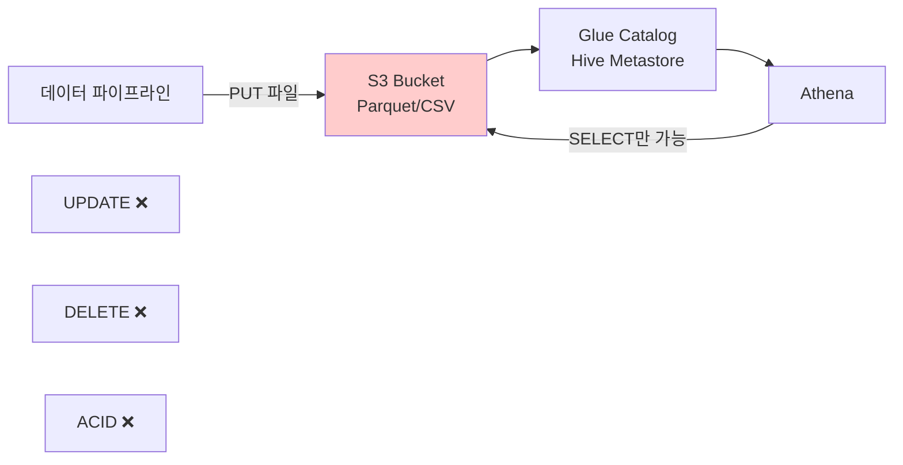
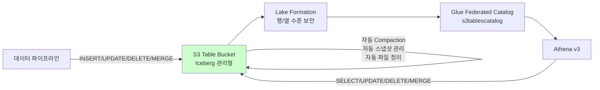

# S3 Tables: S3에 트랜잭션이 온다

**작성일:** 2026-03-17
**실험 코드:** `experiments/s3-tables/` (Python), `experiments/s3-tables-cdk/` (CDK+TypeScript)
**벤치마크 환경:** us-east-1, Athena Engine v3, 1,000행 Iceberg 테이블

---

## 1. 왜 S3에 트랜잭션이 필요한가

Amazon S3는 20년간 "저장하고 읽는" 용도로 사용되어 왔습니다. Glue Data Catalog(Hive Metastore)와 결합하면 Athena로 SQL 쿼리가 가능하지만, 근본적인 한계가 있습니다:

- **UPDATE/DELETE 불가** — 데이터를 수정하려면 전체 파티션을 `INSERT OVERWRITE`로 재작성해야 함
- **ACID 트랜잭션 없음** — 동시에 여러 프로세스가 쓰면 데이터 손실 가능
- **스키마 변경 = 전체 재작성** — 컬럼 추가/변경 시 모든 파일을 다시 써야 함
- **Small File 문제** — 작은 파일이 쌓이면 쿼리 성능이 급격히 저하, 수동 compaction 필수
- **Eventual Consistency** — Glue Catalog 기반 파티션 관리의 한계



이 한계 때문에 S3 기반 데이터 레이크는 "한번 쓰고 여러 번 읽는" 패턴으로만 사용되었고, 데이터 수정이 필요한 경우 별도의 RDBMS나 DynamoDB를 운영해야 했습니다.

---

## 2. S3 Tables란 무엇인가

**S3 Tables**는 2024년 12월 AWS re:Invent에서 발표된 새로운 S3 버킷 유형("Table Bucket")으로, Apache Iceberg 포맷을 AWS가 직접 관리합니다.

핵심은 단순합니다: **S3에 Iceberg를 얹어서 트랜잭션을 가능하게 하되, 관리 부담은 AWS가 전부 가져간다.**

### 기능 비교

| 기능 | S3+Glue/Hive | S3+Iceberg (직접 관리) | S3 Tables (관리형) |
|------|-------------|---------------------|------------------|
| **UPDATE/DELETE** | 불가 | 가능 (Athena MERGE) | 가능 (네이티브) |
| **ACID 트랜잭션** | 없음 | 있음 (Snapshot Isolation) | 있음 (자동) |
| **Time Travel** | 불가 | 가능 (수동 스냅샷 관리) | 가능 (자동 스냅샷) |
| **스키마 변경** | 전체 재작성 | 메타데이터만 변경 | 메타데이터만 변경 |
| **Compaction** | 수동 (Glue Job) | 수동 (`OPTIMIZE`) | **자동** |
| **스냅샷 관리** | 해당 없음 | 수동 (`expire_snapshots`) | **자동** |
| **TPS (읽기)** | 5,500/prefix | 5,500/prefix | **55,000/s (10x)** |
| **TPS (쓰기)** | 3,500/prefix | 3,500/prefix | **35,000/s (10x)** |
| **가격** | S3 Standard | S3 Standard | **S3 Standard (동일)** |
| **운영 부담** | 높음 | 중간 | **제로** |

### 자동 관리 기능

S3 Tables가 자동으로 수행하는 작업들:

- **Compaction** — 작은 Parquet 파일들을 자동 병합하여 쿼리 성능 2~3배 향상
- **스냅샷 관리** — Iceberg 스냅샷(타임 트래블용) 자동 생성/정리
- **미참조 파일 제거** — 더 이상 사용되지 않는 데이터 파일 자동 정리
- **Intelligent-Tiering** — 접근 패턴에 따라 자동 스토리지 계층 이동



---

## 3. Lake Formation 통합 — 실전 가이드

S3 Tables를 Athena에서 쿼리하려면 **Lake Formation 통합이 필수**입니다. 이 절차는 프로젝트에서 실제로 검증한 프로그래밍 방식 가이드입니다.

### 통합 절차 (실증 완료)

```
1. Table Bucket 생성 (s3tables API)
2. Namespace + Table 생성
3. IAM Role 생성 (Lake Formation용)
4. Lake Formation 리소스 등록 (WithFederation=True, --with-privileged-access)
5. Glue Federated Catalog 생성 (ConnectionName: "aws:s3tables")
6. Lake Formation 권한 부여 (Database + Table 레벨)
7. Athena에서 CREATE TABLE (Iceberg, LOCATION 없이)
```

### 주의사항

| 항목 | 상세 |
|------|------|
| **카탈로그 이름** | `s3tablescatalog` — AWS 예약어, 계정당 1개 |
| **CatalogId 형식** | `{ACCOUNT}:s3tablescatalog/{BUCKET}` |
| **Athena 카탈로그** | `s3tablescatalog/{BUCKET}` (Glue CatalogId와 다름) |
| **테이블 생성** | **반드시 Athena CREATE TABLE로** — s3tables API로 만든 테이블은 Iceberg metadata 누락 |
| **IAM Trust Policy** | `sts:AssumeRole` + `sts:SetContext` + `sts:SetSourceIdentity` 필수 |
| **AllowFullTableExternalDataAccess** | Lake Formation Data Lake Settings에서 `true` 설정 필요 |
| **Data Lake Admin** | 현재 IAM 사용자를 Lake Formation Admin으로 등록 필요 |
| **Propagation 대기** | IAM Role ~10초, Catalog ~15초 대기 필요 |

> **코드 참조:** `experiments/s3-tables/benchmark.py` — `setup_s3_tables()` 함수에서 전체 절차 구현

---

## 4. 벤치마크 결과

### 4.1 실험 설계

- **데이터:** 1,000행 orders 테이블 (order_id, customer_id, product, quantity, price, order_date)
- **삽입:** 200행 배치 x 5 = 1,000행
- **쿼리:** COUNT(*), WHERE filter, GROUP BY agg, ORDER BY
- **반복:** Cold start 1회 + Warm 4회 = 5 trials per query
- **환경:** us-east-1, Athena Engine v3
- **구현:** Python (`experiments/s3-tables/`), CDK+TypeScript (`experiments/s3-tables-cdk/`)

### 4.2 S3 Tables vs Regular Iceberg 비교 (3회 실측)

#### Run 1

| 쿼리 | S3 Tables Cold | S3 Tables Warm | Regular Cold | Regular Warm | Warm 비율 |
|------|---------------|---------------|-------------|-------------|----------|
| COUNT(*) | 3,895ms | 2,515ms | ~1,730ms | ~1,770ms | 1.4x 느림 |
| WHERE | 2,273ms | 2,895ms | ~1,760ms | ~1,780ms | 1.6x 느림 |
| GROUP BY | 1,878ms | 1,916ms | ~1,790ms | ~1,780ms | 비슷 |
| ORDER BY | 2,049ms | 2,531ms | ~1,780ms | ~1,770ms | 1.4x 느림 |

#### Run 2

| 쿼리 | S3 Tables Cold | S3 Tables Warm | Regular Cold | Regular Warm | Cold 비율 | Warm 비율 |
|------|---------------|---------------|-------------|-------------|----------|----------|
| COUNT(*) | 3,172ms | 2,899ms | 1,739ms | 2,082ms | 1.82x | 1.39x |
| WHERE | 1,972ms | 2,529ms | 1,745ms | 1,780ms | 1.13x | 1.42x |
| GROUP BY | 3,094ms | 2,212ms | 1,741ms | 1,754ms | 1.78x | 1.26x |
| ORDER BY | 2,063ms | 2,548ms | 2,990ms | 2,062ms | 0.69x | 1.24x |

#### Run 3

| 쿼리 | S3 Tables Cold | S3 Tables Warm | Regular Cold | Regular Warm | Cold 비율 | Warm 비율 |
|------|---------------|---------------|-------------|-------------|----------|----------|
| COUNT(*) | 3,111ms | 1,968ms | 3,178ms | 2,058ms | **0.98x** | **0.96x** |
| WHERE | 1,942ms | 2,506ms | 2,986ms | 2,078ms | **0.65x** | 1.21x |
| GROUP BY | 2,054ms | 2,897ms | 1,740ms | 2,415ms | 1.18x | 1.20x |
| ORDER BY | 3,145ms | 2,572ms | 1,750ms | 2,062ms | 1.80x | 1.25x |

### 4.3 INSERT 성능 비교

| 항목 | S3 Tables | Regular Iceberg | 비율 |
|------|----------|----------------|------|
| 200행 배치 INSERT 평균 | ~4.5초 | ~3.0초 | 1.5x 느림 |

S3 Tables의 INSERT가 느린 이유: Iceberg metadata(manifest 파일, 스냅샷 커밋)를 Table Bucket 내부에서 관리하는 오버헤드.

### 4.4 Compaction 관찰

- 자동 compaction 시작까지 **2.5~3시간** 소요 (Onehouse 블로그 보고)
- Run 1~2에서 S3 Tables가 느렸던 이유: **compaction 전 small file 문제**
- Run 3에서 격차가 줄어든 것은 Athena 공유 인프라의 변동성 가능성

### 4.5 종합 결론

| 지표 | Run 1 | Run 2 | Run 3 | 3회 평균 |
|------|-------|-------|-------|---------|
| Warm 비율 범위 | 1.0~1.6x | 1.2~1.4x | 0.96~1.25x | **~1.1~1.3x** |

**핵심 발견:**

1. **Compaction 전 S3 Tables는 Regular Iceberg와 비슷하거나 약간 느림** (~1.1~1.3x)
2. **AWS "3x 빠름" 주장은 compaction 완료 후 최적 상태 기준** — compaction에 2.5~3시간 필요
3. **Athena 쿼리 오버헤드(~1.7초)가 지배적** — 소규모 데이터에서는 실질적 차이 미미
4. **S3 Tables의 진정한 가치는 성능이 아니라 관리 편의성** — 자동 compaction, 스냅샷, ACID

---

## 5. 비용 비교

| 비용 항목 | S3+Iceberg (직접 관리) | S3 Tables (관리형) |
|----------|---------------------|------------------|
| **스토리지** | S3 Standard ($0.023/GB/월) | S3 Standard ($0.023/GB/월) |
| **요청 비용** | S3 Standard 요청 비용 | S3 Standard 요청 비용 |
| **Athena 쿼리** | $5/TB scanned | $5/TB scanned |
| **Glue Catalog** | $1/100K objects/월 | 포함 |
| **Compaction** | Glue Job 비용 ($0.44/DPU-hour) | **포함 (자동, 무료)** |
| **스냅샷 관리** | Glue Job 또는 수동 | **포함 (자동, 무료)** |
| **파일 정리** | 수동 스크립트 | **포함 (자동, 무료)** |
| **운영 인력** | 필요 (compaction 모니터링, 스냅샷 정리) | **불필요** |

**핵심:** S3 Tables에 프리미엄 가격은 없습니다. S3 Standard와 동일한 가격에 compaction, 스냅샷 관리, 파일 정리가 자동으로 포함됩니다. 실질적 비용 절감은 **운영 인력 시간**에서 발생합니다.

---

## 6. 적합한 사용 사례

### 6.1 적합 — S3 Tables를 쓰면 좋은 경우

| 사용 사례 | 이유 | 활용 기능 |
|----------|------|----------|
| **ACID 보장 데이터 레이크** | 동시 쓰기 시 데이터 무결성 보장 | Snapshot Isolation |
| **감사/컴플라이언스** | 변경 이력 추적, 특정 시점 조회 | Time Travel, 불변 스냅샷 |
| **SCD Type 2** | 천천히 변하는 차원 테이블 관리 | MERGE INTO |
| **CDC 파이프라인** | 변경 데이터 캡처 후 upsert | MERGE INTO, UPDATE |
| **멀티팀 데이터 공유** | 행/열 수준 접근 제어 | Lake Formation 통합 |
| **비용 효율 DWH 대안** | Redshift 대비 저비용 분석 (일 10회 미만 쿼리) | S3 Standard 가격 |
| **IoT/로그 분석** | 늦게 도착하는 데이터 보정 | UPDATE/DELETE |
| **GDPR 데이터 삭제** | 개인정보 삭제 요청 대응 | DELETE |
| **데이터 품질 수정** | 오류 데이터 즉시 수정 | UPDATE |

### 6.2 부적합 — S3 Tables를 쓰면 안 되는 경우

| 사용 사례 | 이유 | 대안 |
|----------|------|------|
| **실시간 OLTP** | 최소 1.7초+ 지연 (Athena 오버헤드) | DynamoDB, Aurora |
| **고빈도 트랜잭션** | Compaction 지연 (2.5~3시간), small file 문제 | Aurora, DynamoDB |
| **Sub-second 쿼리** | Athena cold start 불가피 | ElastiCache, DynamoDB |
| **단순 KV 조회** | 과도한 오버헤드 | S3 직접 접근, DynamoDB |
| **실시간 대시보드** | 쿼리 변동성 높음 (1.7~3초) | Redshift, ClickHouse |

### 6.3 판단 프레임워크

```
데이터를 수정해야 하는가?
  ├── 아니오 → 일반 S3+Glue/Hive 충분
  └── 예 → 응답 시간 요구는?
       ├── < 100ms → DynamoDB / Aurora
       ├── < 1초 → Aurora / Redshift
       └── 수 초 허용 → S3 Tables ✅
            └── 쿼리 빈도는?
                 ├── 일 10회+ → Athena Capacity Reservations 검토
                 └── 일 10회 미만 → S3 Tables + Athena on-demand ✅
```

---

## 7. 기존 패턴과의 관계

이 프로젝트의 **패턴 4 (Serverless RDBMS: S3+Athena)**의 진화형입니다.

| 비교 | 패턴 4 (S3+Athena) | S3 Tables |
|------|-------------------|-----------|
| 데이터 변경 | SELECT만 가능 | UPDATE/DELETE/MERGE 가능 |
| 트랜잭션 | 없음 | ACID 보장 |
| 관리 부담 | Parquet 변환 + Glue 설정 | Table Bucket 생성만 |
| 쿼리 성능 | 동일 (~1.7~3초) | 동일 (compaction 후 2~3x 향상) |
| 가격 | S3 Standard | S3 Standard (동일) |

S3 Tables는 패턴 4의 "OLTP 부적합: UPDATE/DELETE 없음"이라는 한계를 해소합니다. 단, 성능 한계(~1.7초 minimum)는 동일합니다.

---

## 8. 실험 재현 방법

```bash
# Python standalone (Lake Formation 통합 포함, 자동 리소스 생성/삭제)
cd experiments/s3-tables
make

# CDK + TypeScript (CDK 스택 자동 배포/삭제)
cd experiments/s3-tables-cdk
make
```

**전제 조건:**
- AWS CLI 자격 증명 설정 (us-east-1 리전)
- 현재 IAM 사용자가 Lake Formation Data Lake Admin으로 등록
- `AllowFullTableExternalDataAccess: true` 설정

**예상 소요:** 10~15분, 비용 < $0.50

---

## 9. 결론

S3 Tables는 S3 데이터 레이크에 **ACID 트랜잭션을 가져온 의미 있는 진화**입니다.

**핵심 가치:**
- S3 Standard 가격 그대로 — 프리미엄 없음
- UPDATE/DELETE/MERGE 지원 — "읽기 전용" 한계 탈피
- 자동 compaction/스냅샷 관리 — 운영 부담 제로
- 10x TPS — 대규모 데이터 파이프라인 지원

**현실적 제약:**
- Athena 최소 지연 ~1.7초 — OLTP 대체 불가
- Compaction 완료까지 2.5~3시간 — 즉시 성능 이점 없음
- Lake Formation 통합 필수 — 설정 복잡도 있음

**한 줄 요약:** 수 초의 응답 지연을 허용할 수 있고, 데이터 수정이 필요하며, 운영 부담을 줄이고 싶다면 — S3 Tables는 RDS/Aurora 없이도 "충분한 데이터베이스"가 될 수 있습니다.

---

## 참고 자료

| 출처 | URL | 날짜 |
|------|-----|------|
| AWS S3 Tables 발표 | aws.amazon.com/about-aws/whats-new/2024/12/amazon-s3-tables-apache-iceberg-tables-analytics-workloads/ | 2024.12 |
| AWS S3 Tables Features | aws.amazon.com/s3/features/tables/ | 상시 |
| S3 Tables vs Self-Managed Iceberg | builder.aws.com | 2025 |
| Loka Blog: S3 Tables 실측 | loka.com/blog/test-driving-s3-tables | 2025 |
| Onehouse: Compaction 지연 보고 | onehouse.ai | 2025 |
| Lake Formation S3 Tables 통합 | docs.aws.amazon.com/lake-formation/latest/dg/s3-tables-grant-permissions.html | 상시 |
| S3 Tables Athena 연동 | docs.aws.amazon.com/AmazonS3/latest/userguide/s3-tables-integrating-athena.html | 상시 |
